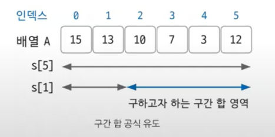
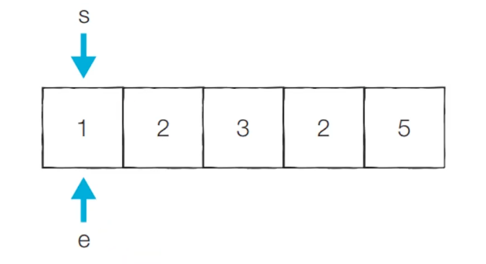

# Do-it 알고리즘 테스트

## 1 ) 시간 복잡도
- 참고 : [링크](https://github.com/edel1212/algorithm/tree/main/time-complexity)

## 2 ) 놓치기 쉬운 중요 개념

### 2 - 1 ) 의도치 않은 결과 값이 음수 일 경우 [ OverFlow ]
- 로직 자체에서 문제가 없다면 **자료형**을 꼭 확인하자 대부분의 문제는 자료형에서 발생함
  - int : -21억 ~ 21억 약 (±21억)
  - long : -9,223,372,036,854,775,808 ~ 9,223,372,036,854,775,807 (약 ±9.22 × 10¹⁸)

### 2 - 2 ) 시간 초과
- 시간 초과가 날 경우 **적절한 시간 복잡도를 사용**하여 처리한다 ( 1초 -> 1억 연산 기준으로 빅오 표기법에 대입하여 처리 )
- 적절한 알고리즘을 사용해도 시간 초과가 날 경우 `Buffered Class`를 사용하여 I/O를 처리
  - 간단한 입출력에서는 Scanner 와 차이가 없지만 **입출력이 많아질 수록 그차이는 점점 커짐**
  - 차이
    - Bad 👎
      - Scanner : 입력 때 마다 필요한 자료형으로 변환하는 과정 필요
      - println : 출력이 발생할 때 마다 버퍼를 지우는 작업이 진행
    - Good 👍
      - BufferedWriter : 입력 버퍼를 저장 한 후 **데이터를 한번에 읽어**옴
      - BufferedReader : 출력 버퍼를 저장 한 후 **데이터를 한번에 출력**함

### 2 - 3 ) 인덱스에 의미 부여 하기 [ 해싱 기법 ]
- 배열에서 index는 일반적으로 **몇번째 데이터**인지를 기준으로 접근하는데 상황에 따라서는 **인덱스에 해싱 개념을 적용**해보자
  - 단순 위치가 아닌 **특정한 의미를 가지는 값으로 사용**하는 것
  - 인덱스를 단순히 순서로만 생각하지 말고 **문제 상황에 따라 다양한 의미로 변환해서 생각하는 것이 중요(해싱 기법)**

### 2 - 4 ) 나머지 연산의 분배 법칙
- 함정 문제로 정답을 OO로 나눈 나머지 값을 출력하는 문제가 있다.
  - 해당 문제의 의도
    - 자료형의 표현 범위를 넘지 않게 유도
    - 나머지 연산의 원리를 아는지 확인

#### 2 - 4 - 1 ) 나머지 연산의 분배 법칙
> 나머지 연산은 **나눗셈을 제외**한 "덧셈, 뺄셈, 곱셉"의 분배 법칙이 성립함
- **덧셈의 분배 법칙**
  - `(A + B) % C` 와 같다 `( A % C + B % C ) % C`
- **뺄셈의 분배 법칙**
  - `(A - B) % C` 와 같다 `( A % C - B % C ) % C`
- **곱셈의 분배 법칙**
  - `(A * B) % C` 와 같다 `( A % C * B % C ) % C`
- **나눗셈의 분배 법칙**
  - ✅ **성립하지 않음**
```text
# PseudoCode

응답 값 = 1
for i = 1 to 50 do

    // 응답 값 *= i 👎 OverFlow 발생
    응답 값 = (응답값 * i) % 10_007 // 👍 곱셈의 분배 법칙으로 인해 OverFlow 방지
    
System.out.println( 응답 값 % 10_007 )
```

### 2 - 5 ) 정렬
- 배열의 경우 `Arrays.sort()` 내장 함수를 사용해서 쉽게 정렬이 가능하다.
  - 오름차순 : `Arrays.sort(new int[]{...})`
  - 내림차순 : `Arrays.sort(new Integer[]{...}, Collections.reverseOrder())`
    - 내림 차순에 사용되는 `Collections.reverseOrder()`를 사용하기 위해서는 기본형이 아닌 **Wrapper Class로 되어있어야 한다.**
    - Wrapper Class 제한이 있을 경우 음수로 변환 후 오름차순 정렬 후 다시 양수로 변환하는 등의 **다양한 접근 방식을 유연하게 떠올리는 것이 중요**

### 2 - 6 ) 다중 조건 정렬
> 참고 : [링크](https://github.com/edel1212/algorithm/blob/main/src/do_it/multiple_sort/ex01.java)
- 다중 조건 정렬을 처리할 떄는 `Comparable`과 `Comparator`가 있다.
- **Comparable** : 클래스 내부에서 자기 자신과 다른 객체 비교 기준 정의
  - 객체 스스로 기준을 가지고 있음.
  - 객체(구현체) 내부에서 내부 호출 사용
- **Comparator** : 외부 클래스/람다로 별도의 비교 기준 정의
  - 외부에서 다양한 기준을 넣어줌.
  - 정렬에 사용 될 Class로 사용 - 구현체 정렬 시 **인자 값으로 주입하여 사용**

### 2 - 7 ) 이차원 리스트
- **그래프를 표현**하는데 자주 사용됨
- 선언 후 메모리에 할당(초기화) 해주는 작업을 진행해 줘야함 ( IndexOutOfBoundException 발생 )
  - `for(int i = 0 ; i < 10 ; i ++) list.get(i).add( new ArrayList() ) `
- 데이터를 저장하거나 가져올 때는 **노드(Node)를 기준**으로 해서 저장 및 데이터를 가져 올 수 있다.

## 3 ) 몰랐던 개념

### 3 - 1 ) 합 배열, 구간의 합
- **합 배열 (배열의 합)**
  - 시간복잡도를 줄이기 위해 사용되는 특수한 목적의 알고리즘
    - 대상이 되는 **배열의 값이 바뀌지 않는한** 미리 계산해 놓은 합 배열의 값을 **다시 계산할 필요가 없다**
      - 세그먼트 트리, 인덱스 트리를 사용하면 사실 값이 바뀌어도 합 배열 사용이 가능함
  - 배열의 합 공식 : `S[i] = S[i - 1] + A[i]`
    - 기본 배열 : `A[]`
    - 배열의 합 : `S[]`
    - `S[0]`일 경우 i-1을 할 수 없기에 `A[0]`을 사용함
- **구간의 합**
  - 전제 조건 : 합 배열로 만들어져 있어야 함
  - 예시 : A의 i ~ j 까지의 합을 구할 경우
  - 구간의 합 공식 : `S[j] - S[i - 1]`
    - 포인트 : **i의 값이 0 이하** 일 경우에는 `S[j]`만 반환한다 (범위를 벗어났기에 제외)  
    - 
- **2차원 합 배열**
  - 공식 : `D[i][j] = D[i-1][j] + D[i][j-1] - D[i-1][j-1] + A[i][j]`
    - 원하는 위치의 상단 좌표 값 + 좌측 좌표값 - 중복된 값 + 원하는 위치의 원본 위치 좌표 값
- **2차원 구간의 합**
  - 공식 : `D[x2][y2] - D[x1-1][y2] - D[x2][y1-1] + D[x1-1][y1-1]`
    - 가장 끝 합 배열 좌표값 - 제외할 상단 값 - 제외할 좌측 값 + 중복해서 제거된 값 

### 3 - 2 ) 투 포인터 ( Two Pointers )

- 배열에 순차적으로 접근해야할 때 두개의 점의 위치를 기록하면서 처리하는 알고리즘
  - O(N²) 의 시간복잡도를 O(N)으로 처리가 가능함
- 각각의 **시작 포인터 위치 와 종료 포인터 위치를 지정한** 후 결과 값을 도출함
  - 각각의 Pointer의 위치는 **문제의 유형 따라 다름**
    - 2개의 수의 합 : [참고](https://github.com/edel1212/algorithm/blob/main/src/baekjoon/twoPointer/%EB%91%90_%EC%88%98%EC%9D%98_%ED%95%A9.java)
    - 지정 범위 합 개수 : [참고](https://github.com/edel1212/algorithm/blob/main/src/do_it/quiz/%EC%88%98%EB%93%A4%EC%9D%98_%ED%95%A9_5.java)

## 3 - 3 ) 슬라이딩 윈도우
- 투 포인터에서 조금 개념만 바꾼 알고르즘 방식이다 ( 지정 범위를 유지하며 한칸 씩 같이 이동 )

## 3 - 4 ) 덱 (Deque)
- 배열의 **앞에서도 추가, 삭제, 조회** || **뒤에서도 추가, 삭제, 조회**가 가능한 자료 구조다
  - ex) `deque.getFirst()`, `deque.getLast()`, `deque.removeFist()` ...

## 4 ) 정렬

### 4 - 1 ) 버블 정렬
- 두 인접한 데이터의 크기를 비교해서 정렬 진행 **간단하게 구현은 가능**하나 **다른 정렬 알고리즘 보다 느린편**
  - 각각의 요소를 비교하며 진행
- 시간 복잡도 : O(N²)
- 버블 소트에서 반복 횟수를 결정하는 건 **얼마나 많이 왼쪽으로 이동했는 원소가 있는가**
- 최적화를 위해 **왼쪽 swap**이 더 이상 없을 경우 **반복문을 종료**

### 4 - 2 ) 선택 정렬
- 배열 내 데이터에서 최대 혹은 최소 데이터를 나열된 순으로 찾아가며 선택하는 **방법 구현이 복작하며 시간 복잡도 또한 좋지 못하다.**
  - 가장 크거나 작은 값을 정한 후 정렬된 대상과 위치를 바꾸는 방식
- 시간 복잡도 : O(N²)
- 자주 사용되지 않는 알고리즘

### 4 - 3 ) 삽입 정렬
- **이미 정렬된 데이터** 범위에 **지정한 값을 알맞은 위치에 삽입** 시켜 정렬하는 방식 **속도는 느린편이지만 구현하기 쉬움**
  - 지정된 key 값을 삽입할 위치를 찾고 찾은 위치의 오른쪽 요소들을 쉬프트한 후 지정 위치에 삽입 하는 방식
- 시간 복잡도 : O(N²)
- **정렬된 위치에서 이진탐색을 활용**할 경우 조금 더 빠르게 삽입될 위치를 찾을 수 있다.
  - 삽입 정렬은 찾는게 빨라도 쉬프트 하는데 시간이 오래 걸리는 단점이 있음

### 4 - 4 ) 퀵 정렬
- **임의의 위치를 피벗으로 정한** 후 **그룹을 나눠가며 정렬**을 진행하는 방식
  - 오름차순 기준으로 진행 할 경우 방법
    - 1 ) 임의의 위치 피벗으로 지정
    - 2 ) 그후 가장 왼쪽, 가장 오른쪽 -1 을 기준으로 투포인트 형식 비교 시작
    - 3 ) 왼쪽은 값이 작을 경우 ++ 왼쪽은 값이 클 경우 -- 포인터를 변경 진행
    - 4 ) 각각의 포인터가 위치를 이동 할 수 없을 경우 서로 값을 swap 진행
    - 5 ) 값이 남아 있을 경우 해당 값과 피벗의 값을 비교 후 피벗 값 위치 이동 하여 그룹을 나눠 줌
    - 6 ) 각각의 그룹을 1 ~ 5 까지 반복 
- 시간 복잡도 : 빠르면 O(nlogn) ~ 최악의 경우는 O(N²)이다.
 
### 4 - 5 ) 병합 정렬
- **분할 정복 방식을 사용**해서 데이터를 **분할하고 분할한 집합을 합치**며 정렬하는 알고르즘
  - 가장 작운 수준의 그룹으로 나눈 후 정렬 후 병합 하며 정렬함
  - 합칠 때 각각의 그룹의 첫번째 Index에 포인터(**투 포인터 방식**)를 둔 후 **Index를 옮기는 방식**으로 진행
- ✨ **응용 문제가 자주 나옴 숙지 필요**
  - 버블 정렬의 swap 횟수 계산
    - 두개의 그룹으로 나눴을 경우 뒤에있는 그룹의 포인터가 앞에있는 그룹의 멏개의 개수를 제외하는지에 맞춰 swap 횟수를 알 수 있다.
- 시간 복잡도 : O(nlogn)

### 4 - 6 ) 기수 정렬
- 값을 비교하지 않고, 비교할 자릿수를 정한다음 해당 **자릿수만 비교하여 정렬을 진행** 하는 알고라즘
- 가수 정렬은 **10개의 Queue를 이용**하여 구현 
  - 0 ~ 9 자릿수를 갖는 각각의 Queue
    - 0에는 한 자릿수 및 10, 20 ... 의 형태의 수가 들어감
- 시간 복잡도 : O(n)

## 5 ) 탐색

### 5 - 1 ) 깊이 우선 탐색 (DFS)
- 그래프 완전 탐색 기법중 하나
- 지정 노드에서 출발하여 탐색할 **한쪽 분기를 정하여 최대 깊이 까지 탐색**을 마친 후 **다시 다른 쪽 분기로 이동하여 탐색**을 수행
- **재귀 함수**를 이용하므로 **스택오버 플로우에 주의**
  - 스택을 사용해서도 구현 가능함 (재귀가 스택 형식으로 동작함)
- 그래프 탐색의 핵심 이론은 한번 **방문한 노드를 다시 방문 하면 안되기**에 배열을 활용하여 **방문 여부를 체크**
  - ✅ 모든 경로를 탐색 할 경우 백트래킹 필요    
- 시간 복잡도
  - 그래프 탐색 DFS : `O(E + V)`
  - 모든 경로 탐색(백트래킹) : `O(2^n)` 

### 5 - 2 ) 백트래킹 
- 문제를 해결하는 탐색 기법 **(문제를 해결 할 수 있는 모든 경로 탐색)**
- **모든 경로를 탐색**하면서 선택한 경로가 유효하지 않거나 조건에 만족하지 못할 경우 **이전 단계로 되돌아가 다른 경로를 시도**하는 알고리즘
- DFS 개념과 매우 유사함 (비슷한 개념으로 봐도 괜찮다.)
- 핵심 이론 : 조건을 만족하지 않는 경로를 **가지치기하여 탐색 범위를 줄이는 것**이 핵심
- 시간 복잡도 : `O(2^d)`
  - `d` : 탐색 깊이


## ✍️ 문제 풀이
- 숫자의 합 구하기 - 11720번 [O]
- 평균 - 1546번 [O]
- 숫자의 합 구하기 - 11659번 [O]
- 구간의 합 구하기 - 11660번 [X]
  - 재풀이 [X,O,O] 
- 나머지 합 - 10986번 [X]
  - 재풀이 [X, X, O, X]
- 연속된 자연수의 합 구하기 - 2018번 [X]
  - 재풀이 [X]
- 주몽 - 1940번 [O]
- 좋은 수 구하기 - 1253번 [X]
  - 재풀이 [X]
- DNA 비밀번호 - 12891번 [X]
  - 재풀이 [O]
- 최솟값 찾기 - 11003번 [X]
  - 재풀이 [X]
- 스택 수열 - 1874번 [X]
  - 재풀이 [O, X]
- 오큰수 - 17298번 [X]
  - 재풀이 [O, X]
- 카드2 - 2164번 [O]
- 절댓값 힙 - 11286번 [X] ( 😭문제와 입력, 출력 값을 잘 읽어보는 자세가 필요 )
  - 재풀이 [O]
- 수 정렬하기 (버블 정렬 이용) - 2750번 [O]
- 소트인사이드 (선택 정렬 이용) - 1427번 [X]
  - 재풀이
    - O
- ATM (삽입 정렬 이용) - 11399번 [X]
  - 재풀이 
    - X : 삽입 대상의 값이 바뀐다는 것(쉬프트로 인해)을 인지하지 못함
- K번째 수 (퀵 정렬 사용) - 11004번 [X]
  - 재풀이
    - X : 구현하지 못함 
- 수 정렬하기 2 (벙합 정렬 사용) - 2751번 [X]
  - 재풀이
    - X : 구현하지 못함
- 버블 소트 (병합 정렬 이용) - 1517번 [X] 
  - 재풀이
    - X : 버블 정렬 구현에 문제가 있었음 + 계산식 및 위치 문제
- 수 정렬하기 3 (기수 정렬 이용) - 10989번 []
- 연결 요소의 개수 - 11724번 [X]
  - 재풀이 [X, X]
- 신기한 소수 - 2023번 [O] ( 😭힌트를 보고 맞춤 )
- ABCDE - 13023번 [X]
- N과 M - 13023번 [X]
- N-Queen - 9663번 [X]