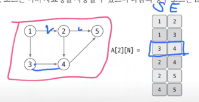
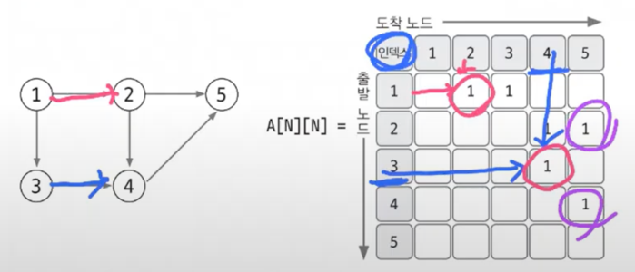
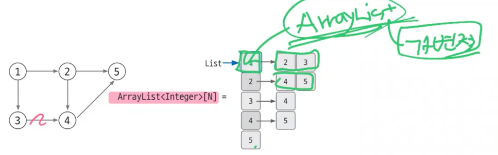
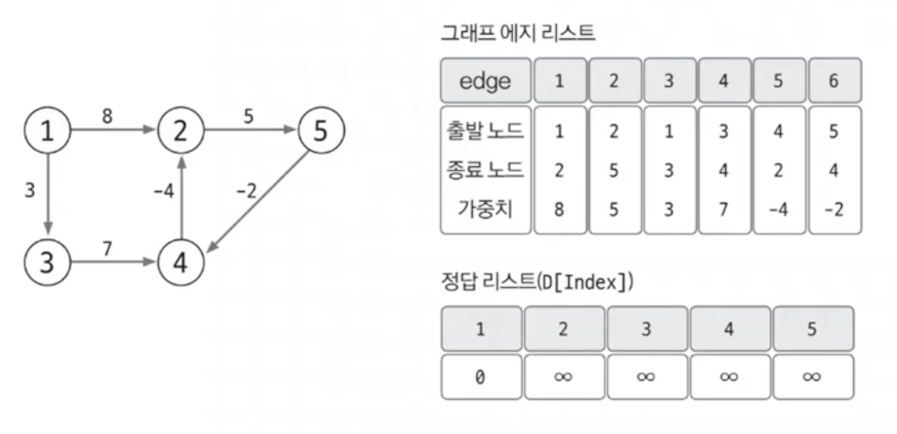

# Do-it 알고리즘 테스트

## 1 ) 시간 복잡도
- 참고 : [링크](https://github.com/edel1212/algorithm/tree/main/time-complexity)

## 2 ) 놓치기 쉬운 중요 개념

### 2 - 1 ) 의도치 않은 결과 값이 음수 일 경우 [ OverFlow ]
- 로직 자체에서 문제가 없다면 **자료형**을 꼭 확인하자 대부분의 문제는 자료형에서 발생함
  - int : -21억 ~ 21억 약 (±21억)
  - long : -9,223,372,036,854,775,808 ~ 9,223,372,036,854,775,807 (약 ±9.22 × 10¹⁸)

### 2 - 2 ) 시간 초과
- 시간 초과가 날 경우 **적절한 시간 복잡도를 사용**하여 처리한다 ( 1초 -> 1억 연산 기준으로 빅오 표기법에 대입하여 처리 )
- 적절한 알고리즘을 사용해도 시간 초과가 날 경우 `Buffered Class`를 사용하여 I/O를 처리
  - 간단한 입출력에서는 Scanner 와 차이가 없지만 **입출력이 많아질 수록 그차이는 점점 커짐**
  - 차이
    - Bad 👎
      - Scanner : 입력 때 마다 필요한 자료형으로 변환하는 과정 필요
      - println : 출력이 발생할 때 마다 버퍼를 지우는 작업이 진행
    - Good 👍
      - BufferedWriter : 입력 버퍼를 저장 한 후 **데이터를 한번에 읽어**옴
      - BufferedReader : 출력 버퍼를 저장 한 후 **데이터를 한번에 출력**함

### 2 - 3 ) 인덱스에 의미 부여 하기 [ 해싱 기법 ]
- 배열에서 index는 일반적으로 **몇번째 데이터**인지를 기준으로 접근하는데 상황에 따라서는 **인덱스에 해싱 개념을 적용**해보자
  - 단순 위치가 아닌 **특정한 의미를 가지는 값으로 사용**하는 것
  - 인덱스를 단순히 순서로만 생각하지 말고 **문제 상황에 따라 다양한 의미로 변환해서 생각하는 것이 중요(해싱 기법)**

### 2 - 4 ) 나머지 연산의 분배 법칙
- 함정 문제로 정답을 OO로 나눈 나머지 값을 출력하는 문제가 있다.
  - 해당 문제의 의도
    - 자료형의 표현 범위를 넘지 않게 유도
    - 나머지 연산의 원리를 아는지 확인

#### 2 - 4 - 1 ) 나머지 연산의 분배 법칙
> 나머지 연산은 **나눗셈을 제외**한 "덧셈, 뺄셈, 곱셉"의 분배 법칙이 성립함
- **덧셈의 분배 법칙**
  - `(A + B) % C` 와 같다 `( A % C + B % C ) % C`
- **뺄셈의 분배 법칙**
  - `(A - B) % C` 와 같다 `( A % C - B % C ) % C`
- **곱셈의 분배 법칙**
  - `(A * B) % C` 와 같다 `( A % C * B % C ) % C`
- **나눗셈의 분배 법칙**
  - ✅ **성립하지 않음**
```text
# PseudoCode

응답 값 = 1
for i = 1 to 50 do

    // 응답 값 *= i 👎 OverFlow 발생
    응답 값 = (응답값 * i) % 10_007 // 👍 곱셈의 분배 법칙으로 인해 OverFlow 방지
    
System.out.println( 응답 값 % 10_007 )
```

### 2 - 5 ) 정렬
- 배열의 경우 `Arrays.sort()` 내장 함수를 사용해서 쉽게 정렬이 가능하다.
  - 오름차순 : `Arrays.sort(new int[]{...})`
  - 내림차순 : `Arrays.sort(new Integer[]{...}, Collections.reverseOrder())`
    - 내림 차순에 사용되는 `Collections.reverseOrder()`를 사용하기 위해서는 기본형이 아닌 **Wrapper Class로 되어있어야 한다.**
    - Wrapper Class 제한이 있을 경우 음수로 변환 후 오름차순 정렬 후 다시 양수로 변환하는 등의 **다양한 접근 방식을 유연하게 떠올리는 것이 중요**

### 2 - 6 ) 다중 조건 정렬
> 참고 : [링크](https://github.com/edel1212/algorithm/blob/main/src/do_it/multiple_sort/ex01.java)
- 다중 조건 정렬을 처리할 떄는 `Comparable`과 `Comparator`가 있다.
- **Comparable** : 클래스 내부에서 자기 자신과 다른 객체 비교 기준 정의
  - 객체 스스로 기준을 가지고 있음.
  - 객체(구현체) 내부에서 내부 호출 사용
- **Comparator** : 외부 클래스/람다로 별도의 비교 기준 정의
  - 외부에서 다양한 기준을 넣어줌.
  - 정렬에 사용 될 Class로 사용 - 구현체 정렬 시 **인자 값으로 주입하여 사용**

### 2 - 7 ) 이차원 리스트
- **그래프를 표현**하는데 자주 사용됨
- 선언 후 메모리에 할당(초기화) 해주는 작업을 진행해 줘야함 ( IndexOutOfBoundException 발생 )
  - `for(int i = 0 ; i < 10 ; i ++) list.get(i).add( new ArrayList() ) `
- 데이터를 저장하거나 가져올 때는 **노드(Node)를 기준**으로 해서 저장 및 데이터를 가져 올 수 있다.

## 3 ) 몰랐던 개념

### 3 - 1 ) 합 배열, 구간의 합
- **합 배열 (배열의 합)**
  - 시간복잡도를 줄이기 위해 사용되는 특수한 목적의 알고리즘
    - 대상이 되는 **배열의 값이 바뀌지 않는한** 미리 계산해 놓은 합 배열의 값을 **다시 계산할 필요가 없다**
      - 세그먼트 트리, 인덱스 트리를 사용하면 사실 값이 바뀌어도 합 배열 사용이 가능함
  - 배열의 합 공식 : `S[i] = S[i - 1] + A[i]`
    - 기본 배열 : `A[]`
    - 배열의 합 : `S[]`
    - `S[0]`일 경우 i-1을 할 수 없기에 `A[0]`을 사용함
- **구간의 합**
  - 전제 조건 : 합 배열로 만들어져 있어야 함
  - 예시 : A의 i ~ j 까지의 합을 구할 경우
  - 구간의 합 공식 : `S[j] - S[i - 1]`
    - 포인트 : **i의 값이 0 이하** 일 경우에는 `S[j]`만 반환한다 (범위를 벗어났기에 제외)  
    - 
- **2차원 합 배열**
  - 공식 : `D[i][j] = D[i-1][j] + D[i][j-1] - D[i-1][j-1] + A[i][j]`
    - 원하는 위치의 상단 좌표 값 + 좌측 좌표값 - 중복된 값 + 원하는 위치의 원본 위치 좌표 값
- **2차원 구간의 합**
  - 공식 : `D[x2][y2] - D[x1-1][y2] - D[x2][y1-1] + D[x1-1][y1-1]`
    - 가장 끝 합 배열 좌표값 - 제외할 상단 값 - 제외할 좌측 값 + 중복해서 제거된 값 

### 3 - 2 ) 투 포인터 ( Two Pointers )

- 배열에 순차적으로 접근해야할 때 두개의 점의 위치를 기록하면서 처리하는 알고리즘
  - O(N²) 의 시간복잡도를 O(N)으로 처리가 가능함
- 각각의 **시작 포인터 위치 와 종료 포인터 위치를 지정한** 후 결과 값을 도출함
  - 각각의 Pointer의 위치는 **문제의 유형 따라 다름**
    - 2개의 수의 합 : [참고](https://github.com/edel1212/algorithm/blob/main/src/baekjoon/twoPointer/%EB%91%90_%EC%88%98%EC%9D%98_%ED%95%A9.java)
    - 지정 범위 합 개수 : [참고](https://github.com/edel1212/algorithm/blob/main/src/do_it/quiz/%EC%88%98%EB%93%A4%EC%9D%98_%ED%95%A9_5.java)

## 3 - 3 ) 슬라이딩 윈도우
- 투 포인터에서 조금 개념만 바꾼 알고르즘 방식이다 ( 지정 범위를 유지하며 한칸 씩 같이 이동 )

## 3 - 4 ) 덱 (Deque)
- 배열의 **앞에서도 추가, 삭제, 조회** || **뒤에서도 추가, 삭제, 조회**가 가능한 자료 구조다
  - ex) `deque.getFirst()`, `deque.getLast()`, `deque.removeFist()` ...

## 4 ) 정렬

### 4 - 1 ) 버블 정렬
- 두 인접한 데이터의 크기를 비교해서 정렬 진행 **간단하게 구현은 가능**하나 **다른 정렬 알고리즘 보다 느린편**
  - 각각의 요소를 비교하며 진행
- 시간 복잡도 : O(N²)
- 버블 소트에서 반복 횟수를 결정하는 건 **얼마나 많이 왼쪽으로 이동했는 원소가 있는가**
- 최적화를 위해 **왼쪽 swap**이 더 이상 없을 경우 **반복문을 종료**

### 4 - 2 ) 선택 정렬
- 배열 내 데이터에서 최대 혹은 최소 데이터를 나열된 순으로 찾아가며 선택하는 **방법 구현이 복작하며 시간 복잡도 또한 좋지 못하다.**
  - 가장 크거나 작은 값을 정한 후 정렬된 대상과 위치를 바꾸는 방식
- 시간 복잡도 : O(N²)
- 자주 사용되지 않는 알고리즘

### 4 - 3 ) 삽입 정렬
- **이미 정렬된 데이터** 범위에 **지정한 값을 알맞은 위치에 삽입** 시켜 정렬하는 방식 **속도는 느린편이지만 구현하기 쉬움**
  - 지정된 key 값을 삽입할 위치를 찾고 찾은 위치의 오른쪽 요소들을 쉬프트한 후 지정 위치에 삽입 하는 방식
- 시간 복잡도 : O(N²)
- **정렬된 위치에서 이진탐색을 활용**할 경우 조금 더 빠르게 삽입될 위치를 찾을 수 있다.
  - 삽입 정렬은 찾는게 빨라도 쉬프트 하는데 시간이 오래 걸리는 단점이 있음

### 4 - 4 ) 퀵 정렬
- **임의의 위치를 피벗으로 정한** 후 **그룹을 나눠가며 정렬**을 진행하는 방식
  - 오름차순 기준으로 진행 할 경우 방법
    - 1 ) 임의의 위치 피벗으로 지정
    - 2 ) 그후 가장 왼쪽, 가장 오른쪽 -1 을 기준으로 투포인트 형식 비교 시작
    - 3 ) 왼쪽은 값이 작을 경우 ++ 왼쪽은 값이 클 경우 -- 포인터를 변경 진행
    - 4 ) 각각의 포인터가 위치를 이동 할 수 없을 경우 서로 값을 swap 진행
    - 5 ) 값이 남아 있을 경우 해당 값과 피벗의 값을 비교 후 피벗 값 위치 이동 하여 그룹을 나눠 줌
    - 6 ) 각각의 그룹을 1 ~ 5 까지 반복 
- 시간 복잡도 : 빠르면 O(nlogn) ~ 최악의 경우는 O(N²)이다.
 
### 4 - 5 ) 병합 정렬
- **분할 정복 방식을 사용**해서 데이터를 **분할하고 분할한 집합을 합치**며 정렬하는 알고르즘
  - 가장 작운 수준의 그룹으로 나눈 후 정렬 후 병합 하며 정렬함
  - 합칠 때 각각의 그룹의 첫번째 Index에 포인터(**투 포인터 방식**)를 둔 후 **Index를 옮기는 방식**으로 진행
- ✨ **응용 문제가 자주 나옴 숙지 필요**
  - 버블 정렬의 swap 횟수 계산
    - 두개의 그룹으로 나눴을 경우 뒤에있는 그룹의 포인터가 앞에있는 그룹의 멏개의 개수를 제외하는지에 맞춰 swap 횟수를 알 수 있다.
- 시간 복잡도 : O(nlogn)

### 4 - 6 ) 기수 정렬
- 값을 비교하지 않고, 비교할 자릿수를 정한다음 해당 **자릿수만 비교하여 정렬을 진행** 하는 알고라즘
- 가수 정렬은 **10개의 Queue를 이용**하여 구현 
  - 0 ~ 9 자릿수를 갖는 각각의 Queue
    - 0에는 한 자릿수 및 10, 20 ... 의 형태의 수가 들어감
- 시간 복잡도 : O(n)

## 5 ) 탐색

### 5 - 1 ) 깊이 우선 탐색 (DFS)
- 그래프 완전 탐색 기법중 하나
- 지정 노드에서 출발하여 탐색할 **한쪽 분기를 정하여 최대 깊이 까지 탐색**을 마친 후 **다시 다른 쪽 분기로 이동하여 탐색**을 수행
- **재귀 함수**를 이용하므로 **스택오버 플로우에 주의**
  - 스택을 사용해서도 구현 가능함 (재귀가 스택 형식으로 동작함)
- 그래프 탐색의 핵심 이론은 한번 **방문한 노드를 다시 방문 하면 안되기**에 배열을 활용하여 **방문 여부를 체크**
  - ✅ 모든 경로를 탐색 할 경우 백트래킹 필요    
- 시간 복잡도
  - 그래프 탐색 DFS : `O(E + V)`
  - 모든 경로 탐색(백트래킹) : `O(2^n)` 

### 5 - 2 ) 백트래킹 
- 문제를 해결하는 탐색 기법 **(문제를 해결 할 수 있는 모든 경로 탐색)**
- **모든 경로를 탐색**하면서 선택한 경로가 유효하지 않거나 조건에 만족하지 못할 경우 **이전 단계로 되돌아가 다른 경로를 시도**하는 알고리즘
- DFS 개념과 매우 유사함 (비슷한 개념으로 봐도 괜찮다.)
- 핵심 이론 : 조건을 만족하지 않는 경로를 **가지치기하여 탐색 범위를 줄이는 것**이 핵심
- 시간 복잡도 : `O(2^d)`
  - `d` : 탐색 깊이
    
### 5 - 3 ) 너비 우선 탐색 (BFS)
- 그래프 완전 탐색 기법중 하나
- 탐색 시작노드와 **가까운 노드를 우선하여 탐색**
- 큐를 이용하여 구현
- 도착하는 경로가 여러 개일 때 **최단 경로를 보장**함
- 시간 복잡도 : `O(V + E)`

### 5 - 4 ) 이진 탐색
- 데이터가 **정렬** 되어 있는 상태에서 원한는 값을 찾아내는 알고리즘이다.
- 찾고자 하는 값을 절반씩 줄여가며 대상을 찾는다.
  - **정렬 데이터에서** 원하는 값을 탐색할 때 **가장 일반적인 알고르즘**
  - 코테에서 **부분 문제**로 **많이 활용**
- 시간 복잡도 : `O(logN)`

## 6 ) 그리디 알고리즘 (탐욕법)
- 현재 보는 선택지 중 최선의 선택지 전채 선택지 중 **최선이라 가정하는 알고르즘**
  - 최적의 해를 보장하지 않는다
- ✅ 그리디를 사용할 수 있는 전제조건이 문제에 작성되어 있다.
  - ex) 동전 문제 내 `1, i ≥ 2인 경우에 Ai는 Ai-1의 배수` => 정규 동전 체계
- 핵심 이론
  - 1 . 해 선택 : 현재의 선택에서 최선이라 생각되 해를 선택
  - 2 . 적절성 검사 : 선택한 해가 전제 조건을 벗어나지 않는지 확인
  - 3 . 해 검사 : 현재까지 선택된 해 집합 문제를 해결할 수 있는지 확인
    - 해결하지 못하면 다시 1번으로 복귀

## 7 ) 정수론

### 7 - 1 ) 소수
- 1과 자기 자신을 갖는 수를 의미한다.
  - 그외의 수는 합성수라 부른다.
- **에라토스테네스의 체 원리**를 사용해서 구하는 것이 일반적이다.
  - 시간 복잡도 : `O(N log(log N))`
  - 원리
    - 구하고자 하는 소수의 범위 반큼 배열 생성
    - "1"은 소수이므로 2부터 시작해서 현재 선택한 숫자가 지워지지 않는 숫자라면 해당 숫자의 배수에 해당 하는 수를 배열에서 제거
    - 배열에 남아 있는 모든 수가 소수이다.
  - 핵심 
    - 소수의 배수는 합성수(소수가 아닌 수)라는 점
    - 반복의 범위는 대상의 **마지막수의 제곱근**까지만 진행
      - 모든 합성수는 반드시 제곱근 이하의 약수를 가지므로 그 이상의 수는 합성수이기에 불필요한 반복 범위이기 때문이다
        - ex) N이 100일 때 10이하의 소수 (2,3,5,7)만으로 모든 합성수를 지울 수 있음
  - #### 쉽게 설명
    - "소수는 남기고, 그 배수는 다 버린다"
    - 1은 소수가 아니므로 제외, 2는 소수이므로 2의 배수를 배열에서 삭제 -> 3은 소수이므로 3의 배수 삭제 ... (반복) = **배열에는 소수만 남음**
    
### 7 - 2 ) 오일러의 피
- 1부터 N까지 범위에서 N과 서로소인 자연수의 개수를 의미한다.
  - ✅ 서로소란 ? : **"1 외에는 공통된 약수가 없는 두 수의 관계"**
    - 7 과 10은 서로소 이다 :: 공통된 약수가 1개 뿐임
- 원리
  - 구하고자 하는 오일러의 피 범위만큼 배열을 초기화 한다.
  - 2부터 시작해 현자 배열의 값과 인덱스가 같으면 현재 선택된 수에 해당하는 수를 탐색하여 **P[i] = P[i] - P[i]/K**를 수행 (i는 K의 배수 || K는 배열의 실제 값)
  - 배열의 끝까지 과정을 반복
- **알고리즘에 자주 출제 되지는 않으나 원리를 알아야 접근이 가능한 문제임**

### 7 - 3 ) 유클리드 호제법
- 두 수의 **최대 공약수를 구하는 알고리즘**
- 핵심 : `MOD(나머지)연산`을 이해하야 함
- 원리
  - 입력 받은 두 수에서 `큰수 % 작은 수` 결과 값을 구함
  - 앞 단계에서 사용한 작은수 와 결과를 MOD 연산 진행 `작은수 % 결과 값`
  - 나머지가 0이 될 때까지 반복 0이 되면 해당 사용했던 **결과 값이 최대 공약수**
- 💬 참고
  - 최소 공배수를 구하는 방법 : `입력값1 * 입력값2 / 최대 공약수`


## 8 ) 그래프
### 8 - 1 ) 그래프 기본
- 유니온 파인드 : 그래프의 **싸이클 유/무 판단**
- 위상 정렬 : 전제 조건이 있음 "그래프 내 사이클이 없어야 함" + 그래프에 방향이 있으면, **노드**를 **정렬 해주는 알고리즘**
  - ✅정렬 관계가 꼭 1개가 아님 여러개 일 수 있음 ( 수강신청 , 롤에서 하위템을 사야 상위 템을 만드는 것 )
- 다익스트라 : (최단거리 알고리즘) - **시작 점이 정해**지고, **음수 간선이 없어야 함**
  - '그리디(Greedy)' 알고리즘이며, "지금 이 순간 가장 가까운 노드가 최단 거리일 거야!"
  - 시간 복잡도 Good 👍
- 벨만-포드 : (최단거리 알고리즘) - **시작 점이 정해**지고, **음수 간선있어도 돼**
  - "느리다! 하지만 음수도 읽고 사고(음수 사이클)도 잡아낸다." (특수한 상황에서 사용)
  - 시간 복잡도 Bad 👎
- 플로이드 워셜 : (최단거리 알고리즘) 시작점이 필요 없고, 임의의 모든 노드쌍 최단 거리를 찾음
  - 시간 복잡도 가장 Bad 👎
- 최소 신장 트리 : 그래프에서 최소의 가중치 합으로 모든 노드를 연결 할 수 있게 하는 알고리즘
  - 사이클이 있으면 안됨 --> **유니온 파인드를 사용해서 확인 함** 
  - `MST`
  
### 8 - 2 ) 그래프 표현

#### 에지 리스트

- 엣지(간선)을 중심으로 그래프를 표현
- 2차원 배열(`A[N][2]`)에 출발, 도착 노드를 지정하여 저장함
  - 방향이 없는 그래프의 경우 2번 저장하는게 더 편할 경우가 많음 [1,2], [2,1] 과 같이 2번 저장
- 가중치가 있을 경우 에지 리스트
  - 열을 3개로 늘려 **S(시작 노드),E(끝 노드) ,V(가중치) 형태**로 저장 함 `A[N][3]`
  - ✅ 단! 특정 노드에 관련된 엣지를 탐색하는건 쉽지 않음 
- 벨만포크, 크루스탈(MST) 알고리즘에 사용
  - 엣지 리스트 기준으로 사용되는 알고리즘임
- **노드 중심 알고리즘에 사용되지 않음**

#### 인접 행렬

- 노드 중심으로 그래프를 표현함
- 노드 개수에 맞는 2차원 배열을 사용해서 표현함 (`A[N][N]`)
- 가중치가 없을 경우 0,1 로 해당 인덱스의 위치에 맞는 곧에 표시함
  - 연결되어 있으면 1을 넣음
- 가중치가 있을 경우 인접 행렬
  - 0,1 대신 가중치를 넣어주면 된다.
- 단 노드에 관련되어 있는 엣지를 탐색하려면 N번 탐색해야 하므로, **노드의 개수보다 엣지가 적을 때 공간 효율성이 떨어짐**
- 노드가 많을 경우 2차원 배열을 선언 자체를 할 수도 없을 수 있음
  - N이 10^9일 경우
- ✅ 따라서 인접 행렬은 노드 개수에 따라 **사용 여부**를 적절하게 **판단하는 능력이 필요**


#### 인접 리스트

- 그래프 알고리즘에서 가장 많이 사용되는 자료 구조이다.
- 노드 개수만큼 ArraysList를 선언 함
  - `ArraysList<Integer>[N]`
- ArrayList는 가변적이므로 연결되는 노드를 표현할 때 편리하다.
- 가중치가 있을 경우
  - Class(객체)를 구현하여 내부에 변수를 추가해준다.
    - `ArraysList<Node>[N]`
- 엣지를 탐색하는 시간이 매우 뛰어남
- 노드 개수가 커도 공간 효율아 좋아 메모리 초과 에러가 발행하지 않음

#### ✅참고
- 인접 리스트: DFS, BFS, 다익스트라 등 일반적인 탐색 문제에서는 90% 이상 인접 리스트를 사용 (대부분은 인접 리스트를 통해 구현이 가능함)
- 인접 행렬 : 노드 수가 적으면(보통 100~400개)  플로이드-워셜 문제에는 고려
- 에지 리스트 : 간선 중심이면 에지 리스트: 벨만-포드나 크루스칼처럼 "모든 간선을 정렬하거나 순회"해야 하면 복잡하게 리스트 만들지 말고 단순한 클래스 배열 사용


### 8 - 3 ) 유니온 파인드
- 특정 2개의 노드를 연결해 1개의 결합으로 묶는 `union연산` 과 두 노드가 같은 집합에 속해 있는지 확인하는 `find연산`으로 구성된 알고리즘
  - `union연산` : 노드 a,b가 있고 a가 A에 속하고, b가 B에 속할 경우 union(a,b) = `A U B`를 의미함 
  - `find연산` : 노드 a가 A에 속해 있을때 find(a) = A집합의 대표 노드를 반환 함 (재귀하며 찾음)
- 핵심 : "Union-Find의 목적은 '관계의 모양'을 만드는 것이 아니라, '누구랑 한 팀인지'만 기록하는 것입니다."
- 유니온 파인드 원리
  - 일반적으로 1차원 배열을 이용함
  - 처음에는 각 모든 노드가 대표 노드로 index값을 value로 함
  - `union연산`은 각 노드를 선택할 경우 value의 값을 이어지는 노드의 값으로 변경 ( 각 노드는 `find`연산을 통해 확인 후 값이 다를 경우 합침 )
    - [1,2,3,4,5,6] 일 때 1,4를 묶고 5,6 묶을 경우
      - [1,2,3,1,5,5] 로 value 값을 바꿈
  - `find연산`은 단순히 대표 노드를 찾는 역할뿐만이 아니라, 그래프 정돈 및 시간 복잡도를 향상 시켜줌
    - 1 . 대상 노드의 value값이 index와 동일한지 확인
    - 2 . 동일하지 않다면 value값이 가르키는 index 위치로 이동
    - 3 . 이동 위치의 index 와 value 값이 같을 때까지 1 ~ 2 를 반복 (재귀 함수를 통해 구현)
    - 4 . 대표 노드에 도달하면 재귀 함수를 빠져나가며 **거치는 모든 노드의 value 값을 루트 노드 값으로 변경**
      - 해당 방법을 통해 find 연산의 속도가 O(1)으로 변경됨

### 8 - 4 ) 위상 정렬
- **사이클이 없는** 방향 그래프에서 노드 순서를 찾는 알고리즘
- 간단하게 요약하면 **"진입차수(in-degree) 배열"을 활용**하여 정렬하는 알고리즘이다
  - 진입차수? : **자신을 가리키는 엣지**의 개수이다.
- 항상 유일한 값으로 정렬되지 않는다.
- 위상 정렬 원리
  - 1 . 인접 배열을 통해 그래프를 표현단다. (사이클이 없는 상태여야 함)
    - 1 - 2 . 이때 진입 차수의 값을 계산하여 진입차수 배열을 같이 만들어 준다. (나를 바라보는 엣지가 있으면 A[i]++)
  - 2 . 진입 차수 배열에서 **value가 0**인 노드를 선택하고 **정렬 배열에 저장**
    - 2 - 1 . 선택된 노드의 인접 리스트를 확인하여 **가리키는 노드들의 진입 차수를 -1**씩 해준다.
      - ✅ 이때 0인 애들이 여러개가 생기기에 정렬이 늘 같은 결과를 보장하지 못한다 하는것이다.
  - 3 . "2" 번을 모든 노드가 정렬될 때까지 반복한다.

### 8 - 5 ) 다익스트라
- 그래프에서 최단거리를 구하는 알고리즘이다.
- 기능 : **출발 노드**와 **모든 노드간**의 **최단 거리** 탐색
  - 문제 요구 사항이 최단 거리를 구하는 문제일 경우 해당 알고리즘을 사용하여 해결 가능
- ✅ 중요 특징 : **엣지에 할당된 가중치**는 **모두 양수**여야 한다.
- 시간 복잡도 : `O(ElogV)`
- 다익스트라 원리
  - 1 . 주어진 데이터를 사용해여 **List<List<Node>>** 인접 리스트 형태로 그래프를 만든다.
  - 2 . **최단 거리를 저장 할 배열 생성** 후 **출발 노드의 value만 0**으로 초기화 후 나머지 value는 `Ingeger.MAX_VALUE`로 지정한다.
  - 3 . 최단 거리를 저장한 배열에서 **value가 가장 작은 노드를 선택**
  - 4 . "3"에서 선택된 노드를 "1"에서 생성한 그래프에서 인접한 데이터를 찾은 후 **가중치 값을 사용 다른 노드의 value를 업데이트**
    - 최단 거리에서 선택된 노드의 값이 1 일 경우 `graph.get(1)` -> Node 의 값을 받아옴
    - Node의 값이 `targetIndex : 2`, `weight : 8` 이라면 해당 2번 타겟 노드의 최단거리 배열 값 업데이트
      - 최단거리 배열[2] = Math.min( 선택 노드의 최단 거리 value + Node.weigh , 연결 노드의 최단 거리 value )
        - ex) `D[2] = Math.min( D[1] + Node.weigh , D[2] )`
  - 5 . **방문 처리 배열을 사용**하여, "3" ~ "4" 모든 노드가 처리될 때까지 과정을 반복
    - 실제 완성된 출발 거리 배열은 출발 ~ 도착 까지의 정보만 저장한다 생각 하지만 실제로는 **출발 노드와 이외 모든 노드 간의 최단 거리를 가지고 있음**

### 8 - 6 ) 벨만-포드

- 다익스트라와 마찬가지로 최단거리를 구하는 알고리즘이다.
  - 최단거리 알고리즘을 구하는 용도로는 **음수 사이클의 존재를 확인**할 때 많이 **사용함**
- ✅ 중요 특징 :  **음수 사이클 존재 여부를 판단** 할 수 있다.
  - 가중치에 **음수가 있어도 최단거리를 구할** 수 있다.
- 시간 복잡도 : `O(VE)`
- **엣지(간선) 중심으로 동작**하므로 그래프를 **엣지를 사용한 그래프**로 만들어야 함
- 벤만-포드 원리
  - 1 . 주어진 엣지를 사용해여 **List<Edge>**형태의 인접 리스트 형태로 그래프를 만든다.
  - 2 . **최단 거리를 저장 할 배열 생성** 후 **출발 노드의 value만 0**으로 초기화 후 나머지 value는 `Ingeger.MAX_VALUE`로 지정한다.
  - 3 . **모든 엣지**를 확인해 **최단 거리 배열을 업데이트** 함
    - 3 - 1 . ✅ 업데이트 반복 획수는 `노드 개수 - 1` 이다. (간선은 노드의 개수보다 크거나 같을 수 없음 - 사이클이 생기기 때문)
    - 3 - 2 . 업데이트 조건 : `D[Start] != Integer.MAX_VALUE && D[End] > D[Srat] + Weight`
- 4 . "3"의 반복 `N-1`만큼의 반복을 거치면 출발 노드와 모든 노드간의 최단 거리를 알 수있는 배열 `D[]`가 완성된다.
- 5 . ✨ 음수 사이클 유무 체크
  - 5 - 1 . 모든 엣지를 한번씩 다시 사용해 업데이트되는 노드가 발생 되는지 확인하며, 업데이트되는 노드가 발생 시 음수가 있다는 뜻이다.
    - 도출한 정답이 의미 없고 최단 거릴르 찾을 수 없는 그래프라는 뜻이 된다.

### 8 - 7 ) 플로이드-워셜
- **모든 노드**간에 최단 거리를 탐색하는 알고리즘
  - 음수 가중치가 있어도 가능함
- 동적계획법의 원리를 이용해 알고리즘에 접근함
- 시간 복잡도 : `O(V^3)` 
  - **시간 복잡도가 좋지 못하다** 노드의 게수가 적을 때 사용을 고려하자
  - 노드의 개수를 확인하고 가능하다면 **인접 행렬로 처리**하는게 시간 복잡도 면에서 훨씬 좋다. 
- 핵심 이론 : `A -> B`의 최단 경로를 구했을 때 그 사이 `K`가 존재한다면, **그것을 이루는 부분 경로 역시 최단경로**이다.
- ✅ 알고리즘 로직 (간단하니 그냥 외우자)  
```text
// 3중 반복문 (K ->S -> E) 순서
for 경유지 K에 관해 (1 ~ N)  // N은 노드의 개수
    for 출발 노드 S에 관해 (1 ~ N)
        for 도착 노드 E에 관해 (1 ~ N)
            D[S][E] = Math.min( D[S][E], D[S][K] + D[K][E] );
``` 

### 8 - 8 ) 최소 신장트리 (MST)
- 그래프에서 모든 노드를 연결할 때 사용된 **엣지(간선)의 가중치의 합을 최소 하는 트리**이다.
- 중요 포인트
  - 엣지를 사용한 1차원 배열을 사용해서 graph를 생성한다.
  - 사이클이 포함되면 가중치의 합을 알 수 없기에 가중치를 확인한다. ( `union-find`알고리즘을 사용 )
- 결과적으로 `union-find` 와 `엣지 배열`을 초기화 및 구현할 줄 알아야 풀 수 있는 알고리즘이다.
- 최소 신장트리 원리
  - 1 . 엣지 리스트(그래프) initialization
  - 2 . union-find에 사용할 상위 배열 initialization
    - ✅ 사이클 판별을 위해 사용
  - 3 . 엣지 리스트를 **가중치 기준 오름차순으로 정렬**
    - ✅ 가중치의 최소 합을 구하기 위함
  - 4 . 가중치가 낮은 엣지부터 연결을 시도
    - 4 - 1 . 이때 `union-find`알고리즘을 통해 연결을 시도 하려는 **노드 사이의 사이클을 확인**
  - 5 . 전체 과정을 **최대 간선 개수**인 `N-1`번이 될 때까지 **"4"번 과정을 반복**한다.
    - 사이클이 생긴 경우 카운트에서 제외하여 진행


## ✍️ 문제 풀이
- 숫자의 합 구하기 - 11720번 [O]
- 평균 - 1546번 [O]
- 숫자의 합 구하기 - 11659번 [O]
- [✅] 구간 합 구하기 5 - 11660번 [X]  
- [✅] 나머지 합 - 10986번 [X]
  - 재풀이
    - X 
    - X 
    - O 
    - X : n개 중에서 2개를 선택하는 경우의 수 공식 햇갈림
    - X : 공식 또 틀림 나머지 계산 시 overflow 생각하기 (값의 범위를 확인)
    - X : 사용해야하는 아이디어는 떠올렸으나 구현하지 못함다
    - O 
    - O 
    - O
    - O
- 수들의 합 5 - 2018번 [X]
  - 재풀이
    - X
    - X :
      - 비교하려는 값이 단순 합산이 아닌 구간의 합으로 했어야 함
      - 투 포인터를 너무 한가지 방법으로 만 사용함 left와 right 둘 다 ++ 하는 방식으로 진행이 가능함 --, ++ 만 쓰는게 아님
    - O
    - X : 사용해야하는 알고리즘을 떠올리지 못 함 
    - O 
    - O 
- 주몽 - 1940번 [O]
- 좋다 - 1253번 [X]
  - 재풀이 
    - X
    - X : 
      - 투포인터의 기본 전제 조건 개념이 부족했음
      - 문제를 잘 읽어보는 습관 필요
    - O
    - X : "다른 수 두 개의 합"이라는 의도를 놓치고 풀의 함
    - X : 투포인터의 정렬의 중요성을 간과함, 그러므로 end 포인터의 위치를 잘못잡음 (입력값 기준으로 문제를 풀려고만 함)
- DNA 비밀번호 - 12891번 [X]
  - 재풀이 
    - O
    - X : 사용해야하는 알고리즘 못찾음 + 사용 알고리즘 이힌트를 받고도 구현하지 못함
    - X : 남은 범위 이동을 잘못 구현함
    - X : 슬라이딩 부분을 잘못 구현함
    - O
- 최솟값 찾기 - 11003번 [X]
  - 재풀이 
    - X
    - X : 올바른 자료구조는 사용했으나 구현하지 못함
    - X : 비교 공식을 틀림 그림을 그려보자
    - X : 슬라이딩 윈도우로 미뤄졌을 경우 앞의 Index 처리 방법을 떠올리지 못함 + 효율적안 구현 방법을 생각해 내지 못함
    - O
- 스택 수열 - 1874번 [X]
  - 재풀이 
    - O
    - X
    - X : 구현하지 못함
    - X : 구조는 잡았지만 구현하지 못함 - 스택 원리 한번 더 생각 및 문제를 확인하여 원리 파악하면 쉬움
    - X : 문제를 올바르게 이해하지 못함
    - O
- 오큰수 - 17298번 [X]
  - 재풀이 
    - O
    - X
    - X : 풀지 못함
    - X : 한개의 자료구조를 가지고 할게 아닌 여러개를 쓸 생각을 하자 너무 1차원적 사고가 문제
    - X : 스택에는 무조건 값을 저장해야 한다는 고정관념을 버리자
    - O
- 카드2 - 2164번 [O]
- [✅] 절댓값 힙 - 11286번 [X] ( 😭문제와 입력, 출력 값을 잘 읽어보는 자세가 필요 )
  - 재풀이 [O, O]
- [✅]수 정렬하기 (버블 정렬 이용) - 2750번 [O]
- [✅]소트인사이드 (선택 정렬 이용) - 1427번 [X]
  - 재풀이
    - O
- ATM (삽입 정렬 이용) - 11399번 [X]
  - 재풀이 
    - X : 삽입 대상의 값이 바뀐다는 것(쉬프트로 인해)을 인지하지 못함
    - X : 구현하지 못함
    - O
- K번째 수 (퀵 정렬 사용) - 11004번 [X]
  - 재풀이
    - X : 구현하지 못함 
    - X : 구현하지 못함 
- 수 정렬하기 2 (벙합 정렬 사용) - 2751번 [X]
  - 재풀이
    - X : 구현하지 못함
- 버블 소트 (병합 정렬 이용) - 1517번 [X] 
  - 재풀이
    - X : 버블 정렬 구현에 문제가 있었음 + 계산식 및 위치 문제
- 수 정렬하기 3 (기수 정렬 이용) - 10989번 []
- 연결 요소의 개수 - 11724번 [X]
  - 재풀이
    - X
    - X
    - X : 개수 카운트 및 visited 방문 지정 위치를 틀림
    - X : 똑같이 또 틀림 사고 단위를 **정점 → 묶음**으로 바꿀 필요가 있음
    - O
- 신기한 소수 - 2023번 [O..?] 
  - 재풀이
    - X
      - 소수 구분 메서드 구현하지 못함
      - dfs 부분 구현 못함
      - 초기 시작값 부분 이유를 몰랐음( 문제를 잘 읽어보는거 필요 )
    - X : 같은 이유로 구현하지 못함
- ABCDE - 13023번 [X]
  - 재풀이
    - X : 문제를 잘 읽어보자! 문제를 자세하게 읽어보지 않아 구현 알고리즘 선택 실수
- N과 M - 15649번 [X]
  - 재풀이
    - X : 아이디어를 생각해내지 못함
- N-Queen - 9663번 [X]
  - 재풀이
    - X : 아이디어를 생각해내지 못함
    - X : 대각선에 위치하는지 아는 방법은 2차원 배열을 1차원 배열로 압축했을 경우 대상의 행-행, 열-열 의 절대 값이 같으면 같은 대각선상에 있는 것
- 색종이 붙이기 - 17136번 [X]
  - 재풀이
    - X : 아이디어를 생각해냈으나 구현하지 못함
- [✅]DFS와 BFS - 1260번 [X]
  - 재풀이 [O]
- 미로 탐색 - 2178번 [X]
  - 재풀이
    - X
    - O
    - X : 구현하지 못함
    - X : 아이디어는 맞췄지만 구현을 잘못한 check를 따로 해야한다 생각함
- 트리의 지름 - 1167번 [X]
- 수 찾기 - 1920번 [X]
  - 재풀이
    - O
- 기타 레슨 - 2343번 [X]
  - 재풀이
    - X : 아이디어는 맞췄으나 이진 탐색 내부 용량 로직을 구현 못함
    - X : CD 사용 룡량 합산 부분 생각해 내지 못함, 이진 탐색 위치 지정 조건문 틀림
    - X : 용량 합산 조건식을 잘못함 조금 더 넒게 생각하자 조건식에서도 덧셈을 쓸 수 있음
    - O
- K번째 수 (이진 탐색) - 1300번 [X]
  - 재풀이
    - X : 문제의 아이디어를 이해하지 못하는 중
    - X : 이진 탐색 반복문 조건이 틀림, 아이디어 비교 조건문이 틀림
    - X : 아이디어를 떠올리지 못함
    - X : 카운트 조건식을 틀림
    - X : 결과 응답값 대상을 틀림
- [✅]동전 0 - 11047번 [O] : 문제 조건을 읽어보면 그리디 사용 여부를 알 수 있음
  - 재풀이
    - O
- 카드 정렬하기 - 1715번 [X]
  - 재풀이
    - O
- 수 묶기 - 1744번 [X] : 문제의 본질 케이스를 빼먹음 과 음수, 음수 일 경우 케이스 처리를 구현하지 못함
  - X : 두개씩 묶는 방법을 떠올리지 못함
- 회의실 배정  - 1931번 [X] : 문제 분석을 잘못함 시작 시간 기준 정렬 -> 사용시간 정렬로 생각했지만 종료시간을 빠르게(**더 많은 회의 횟수 확보**) 해야했음 (굳이 힙 사용 불필요함)
  - X : 그리디의 핵심을 이해하지 못함! (어떤게 최선인가 기준을 잘 잡자)
- 잃어버린 괄호  - 1514번 [X] : 아이디어를 생각해 내지 못함
- 소수 구하기 - 1929번 [X] 
- 거의 소수 - 1456번 [X] : N제곱 부분을 제대로 구현하지 못함(overflow, 반복문 범위 지정) 
- 소수&팰린드롬  - 1747번 [X] 
- 제곱 ㄴㄴ 수  - 1016번 [X]
  - 재풀이
    - O
- 최소공배수  - 1934번 : 공식 `입력 값1 * 입력 값2 / 최대 공약수`
- 최대공약수  - 1850번 [X] : **"1이 반복되는 두 수의 최대공약수는, '두 수의 길이에 대한 최대공약수'만큼 1을 반복한 수이다."**
- 칵테일  - 1033번 [X] : 아예 풀지 못함 코드를 보고도 이해 못하는 중
- 특정 거리의 도시 찾기  - 18352 [X] : 방문 거리를 저장하는 배열을 사용할 수 있다!
  - 재풀이
    - O
- 효육적인 해킹  - 1325 [X] : 시간 초과와의 싸
  - 재풀이
    - O
- 이분 그래프  - 1707 [X] : 그래프의 형태를 확인하자 "이분 그래프(Bipartite Graph)의 정의 및 인접한 두 정점" 로 유추, 그래프가 쪼개졌을 경우도 생각야 함
  - 재풀이
    - O
    - X : DFS 방식 풀의 오답 
- 물통  - 2251 [X] : 풀지 못함
  - 재풀이
    - X : 근접하게 풀의 했지만 경우의 수 물통 옮기기 사용에서 헷갈림 
- 집합의 표현  - 1717 [X] : 문제를 이해하지 못해 풀지 못함
  - 재풀이
    - X : 마지막 비교 연산하는 대상 지정을 햇갈림
- 여행 가자  - 1976 [X] 
  -  문제 접근을 잘못함 BFS로 풀려 했음 (union) - **경유해도 상관없고 재방문도 가능하기에 도달 가능성만 본다**가 포인트
    - 결과적으로 문제 이해를 제대로 못했었음 입력값은 인접 행렬 형식으로 주어진거 였음
  - 재풀이
    - O 
    - X : find를 해야하는 대상 지정을 못함 (Union-Find 알고리즘의 본질을 생각하자 - 대장이 같으면 이어져 있어!!)
- 거짓말  - 1043 [X] : 파티일 경우 어떻게 union을 해줘야하는지 알지 못 함(union-find의 "이행성"을 사용하자)
  - 재풀이
    - X : 인접 행렬을 어떻게 구성해야 할지 진행 못하여 union-find 부분까지 구현하지 못 함
- 줄 세우기  - 2252
  - 재풀이
    - X : queue 에 입력차수 배열의 0일 어떤것 넣어야 하는지 헷갈림 (Loop 하면 된다.)
    - O
- 게임 개발  - 1516
  - 재풀이
    - X :
      - graph의 연관 관계 및 진입 차수 지정 값을 잘못 정함 (위상 정렬 그래프에서 $A -> B$ 간선은 **"A를 완료해야 B로 갈 수 있다"**는 뜻)
      - 위상 정렬의 구조는 잡았으나 소요 시간을 어떻게 구하는지 구현 하지 못함
    - O
- 최단경로 - 1753 [X] : 문제를 BFS 방식으로 접근함 ! 다익스라는 visit 사용법과 PriorityQueue를 사용해야 함!
  - 재풀이
    - O
- 최소비용 구하기  - 1916 [X] : PQ에 저장하는 가중치를 한개의 경로만 넣어 저장함, PQ 메모리 최적화 하지 않음 조건문으로 무조건 offer() 안하게 할 수있음
- K번째 최단경로 찾기  - 1854 [X] : 최단 경로를 우선순위 큐에 넣고 내림 차순으로 활용하는 아이디어를 떠올리지 못함 (모든 경로를 저장한 후 찾는다가 포인트)
  - 재풀이
    - X : allCityDistance를 어떻게 초기화 할지 기억해내지 못함, allCityDistance의 사용할 제네릭을 너무 어렵게 생각함
    - X : 최단 거리 값의 init을 고민함 (전광판이기에 필요 없음, 단 -> 다익스트라 시작 0 값은 초기화 필요 ) \\ 시간에 대해 잘 못 이해함 다익스트라는 항상 **"시작점으로부터의 거리"**를 저장이 **포인트**
- 타임머신  - 11657 [X] : 가중치가 음수이거나 0이 라는 것은 무한히 뒤로 간다는게 아니라 그만큼 **시간을 단축 할 수 있단 의미**
  - 재풀이
    - X : 업데이트 조건식을 잘못 세워서 구현함
    - O
- 오민식의 고민  - 1219 [X] : 구현하는 방법을 생각하지 못함
  - 재풀이
    - X : 기본 벨만-포크와 차이점을 헷갈림 해당 문제의 포커싱은 어떻게 하면 더 높은 값을 얻느냐 이기에 최단 거리 초기화 및 저장 방법이 다름  !
- 플로이드 - 11404 [X] : 초가깂 init 및 3중 반복문의 `K, S, E` 값을 무엇으로 할지 정하지 못했음- 회의실 배정  - 1931번 [X] : 문제 분석을 잘못함 시작 시간 기준 정렬 -> 사용시간 정렬로 생각했지만 종료시간을 빠르게(**더 많은 회의 횟수 확보**) 해야했음 (굳이 힙 사용 불필요함)
  - X : 그리디의 핵심을 이해하지 못함! (어떤게 최선인가 기준을 잘 잡자)
- 잃어버린 괄호  - 1514번 [X] : 아이디어를 생각해 내지 못함
- 소수 구하기 - 1929번 [X] 
- 거의 소수 - 1456번 [X] : N제곱 부분을 제대로 구현하지 못함(overflow, 반복문 범위 지정) 
- 소수&팰린드롬  - 1747번 [X] 
- 제곱 ㄴㄴ 수  - 1016번 [X]
  - 재풀이
    - O
- 최소공배수  - 1934번 : 공식 `입력 값1 * 입력 값2 / 최대 공약수`
- 최대공약수  - 1850번 [X] : **"1이 반복되는 두 수의 최대공약수는, '두 수의 길이에 대한 최대공약수'만큼 1을 반복한 수이다."**
- 칵테일  - 1033번 [X] : 아예 풀지 못함 코드를 보고도 이해 못하는 중
- 특정 거리의 도시 찾기  - 18352 [X] : 방문 거리를 저장하는 배열을 사용할 수 있다!
  - 재풀이
    - O
- 효육적인 해킹  - 1325 [X] : 시간 초과와의 싸
  - 재풀이
    - O
- 이분 그래프  - 1707 [X] : 그래프의 형태를 확인하자 "이분 그래프(Bipartite Graph)의 정의 및 인접한 두 정점" 로 유추, 그래프가 쪼개졌을 경우도 생각야 함
  - 재풀이
    - O
    - X : DFS 방식 풀의 오답 
- 물통  - 2251 [X] : 풀지 못함
  - 재풀이
    - X : 근접하게 풀의 했지만 경우의 수 물통 옮기기 사용에서 헷갈림 
- 집합의 표현  - 1717 [X] : 문제를 이해하지 못해 풀지 못함
  - 재풀이
    - X : 마지막 비교 연산하는 대상 지정을 햇갈림
- 여행 가자  - 1976 [X] 
  -  문제 접근을 잘못함 BFS로 풀려 했음 (union) - **경유해도 상관없고 재방문도 가능하기에 도달 가능성만 본다**가 포인트
    - 결과적으로 문제 이해를 제대로 못했었음 입력값은 인접 행렬 형식으로 주어진거 였음
  - 재풀이
    - O 
    - X : find를 해야하는 대상 지정을 못함 (Union-Find 알고리즘의 본질을 생각하자 - 대장이 같으면 이어져 있어!!)
- 거짓말  - 1043 [X] : 파티일 경우 어떻게 union을 해줘야하는지 알지 못 함(union-find의 "이행성"을 사용하자)
  - 재풀이
    - X : 인접 행렬을 어떻게 구성해야 할지 진행 못하여 union-find 부분까지 구현하지 못 함
- 줄 세우기  - 2252
  - 재풀이
    - X : queue 에 입력차수 배열의 0일 어떤것 넣어야 하는지 헷갈림 (Loop 하면 된다.)
    - O
- 게임 개발  - 1516
  - 재풀이
    - X :
      - graph의 연관 관계 및 진입 차수 지정 값을 잘못 정함 (위상 정렬 그래프에서 $A -> B$ 간선은 **"A를 완료해야 B로 갈 수 있다"**는 뜻)
      - 위상 정렬의 구조는 잡았으나 소요 시간을 어떻게 구하는지 구현 하지 못함
    - O
- 최단경로 - 1753 [X] : 문제를 BFS 방식으로 접근함 ! 다익스라는 visit 사용법과 PriorityQueue를 사용해야 함!
  - 재풀이
    - O
- 최소비용 구하기  - 1916 [X] : PQ에 저장하는 가중치를 한개의 경로만 넣어 저장함, PQ 메모리 최적화 하지 않음 조건문으로 무조건 offer() 안하게 할 수있음
  - 재풀이
    - O
- K번째 최단경로 찾기  - 1854 [X] : 최단 경로를 우선순위 큐에 넣고 내림 차순으로 활용하는 아이디어를 떠올리지 못함 (모든 경로를 저장한 후 찾는다가 포인트)
  - 재풀이
    - X : allCityDistance를 어떻게 초기화 할지 기억해내지 못함, allCityDistance의 사용할 제네릭을 너무 어렵게 생각함
    - X : 최단 거리 값의 init을 고민함 (전광판이기에 필요 없음, 단 -> 다익스트라 시작 0 값은 초기화 필요 ) \\ 시간에 대해 잘 못 이해함 다익스트라는 항상 **"시작점으로부터의 거리"**를 저장이 **포인트**
    - O
- 타임머신  - 11657 [X] : 가중치가 음수이거나 0이 라는 것은 무한히 뒤로 간다는게 아니라 그만큼 **시간을 단축 할 수 있단 의미**
  - 재풀이
    - X : 업데이트 조건식을 잘못 세워서 구현함
    - O
- 오민식의 고민  - 1219 [X] : 구현하는 방법을 생각하지 못함
  - 재풀이
    - X : 기본 벨만-포드와 차이점을 헷갈림 해당 문제의 포커싱은 어떻게 하면 더 높은 값을 얻느냐 이기에 최단 거리 초기화 및 저장 방법이 다름
    - X : 벨만-포드 알고리즘을 기억하지 못함 
- 플로이드 - 11404 [X] : 초가깂 init 및 3중 반복문의 `K, S, E` 값을 무엇으로 할지 정하지 못했음
  - 재풀이
    - O
- 경로 찾기 - 11403 [X] : S -> K && K -> E 아 연결 되어 있다면, S -> E 도 연결 되어있다 (why? S -> E 가 연결되어 있다면 사이에 K가 있다면 중간은 다 연결되어 있기 떄문임)
  - 재풀이
    - X :
  - 오답 이유 ? 알고리즘의 원리는 맞게 생각하 였으나 인접 행렬에 대한 인식이 부족했음 위치가 같을 경우로 진행 했음
  - 잘못된 예시 : `if(dist[S][K] ==  dist[K][E]) dist[S][E] = 1;`
  - 해답 :  "S -> E 중간에 K가 있다면 S -> K와 K -> E 도 **최단거리**이다", "S -> E로 가는 길이 이미 있거나, K를 거쳐 갈 수 있어도 해당 길은 경로가 있다."
- 최소 스패닝 트리 - 1197 [X] : `union-find` 알고리즘을 정상적으로 구현하지 못함 + 반복 횟수 카운트의 위치를 잘못 카운트하여 진행함 카운트는 사이클이 없을 때 해야한다.
