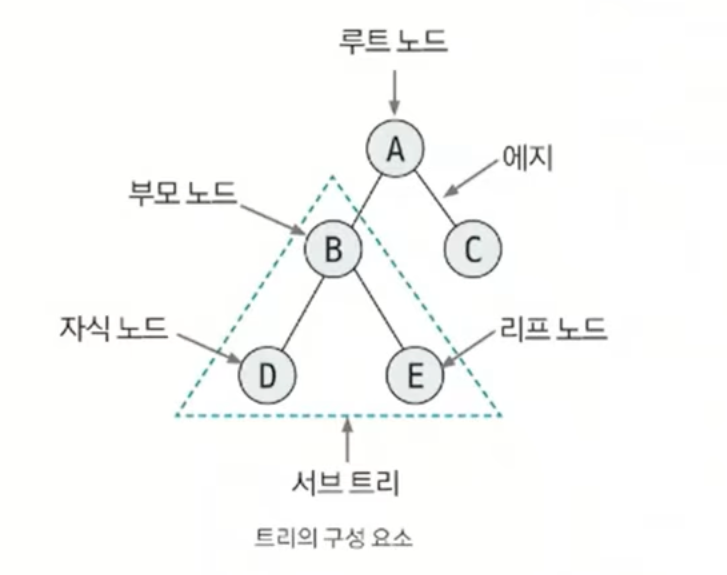
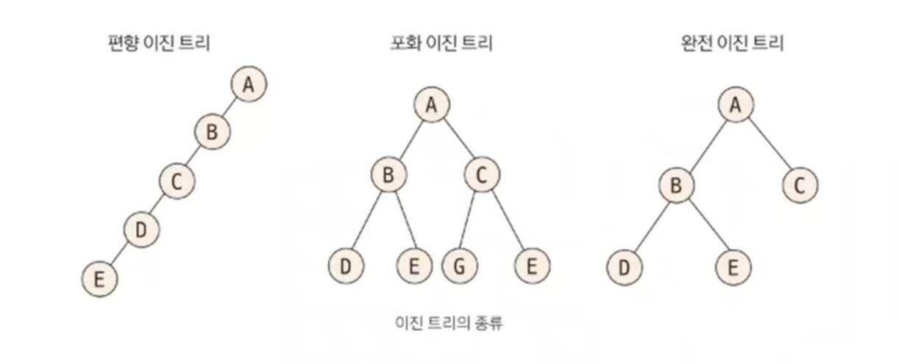
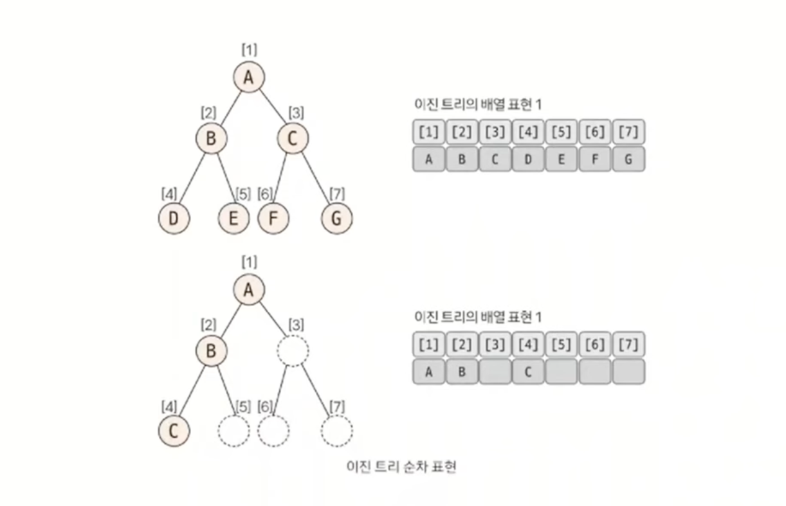
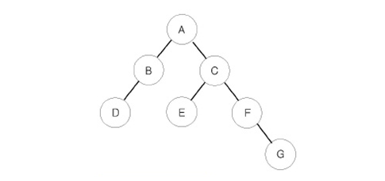
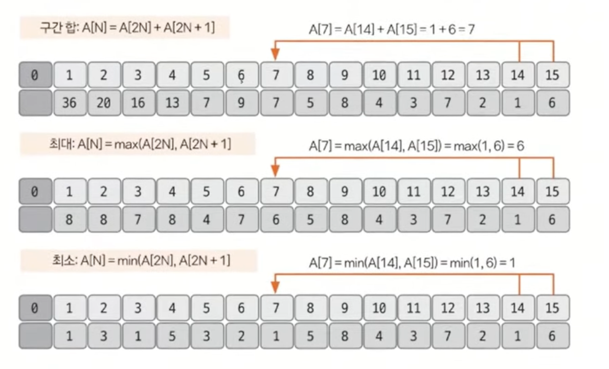
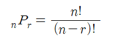
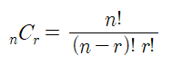
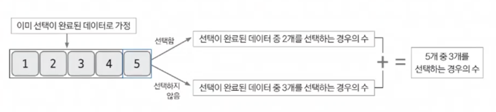

# Do-it 알고리즘 테스트

## 시간 복잡도 - [링크](https://github.com/edel1212/algorithm/tree/main/time-complexity)

## 놓치기 쉬운 중요 개념

### 1 ) 의도치 않은 결과 값이 음수 일 경우 [ OverFlow ]

- 로직에서 문제가 없다면 **자료형**을 확인 해보자, 대부분의 **자료형 문제 발생 多**
  - int : -21억 ~ 21억 약 (±21억)
  - long : -9,223,372,036,854,775,808 ~ 9,223,372,036,854,775,807 (약 ±9.22 × 10¹⁸)

### 2 ) 시간 초과 대처 방법

- 방법 1 : **시간복잡도에 맞는 알고리즘 사용** ( 1초 -> 1억 연산 기준으로 빅오 표기법에 대입하여 처리 )
- 방법 2 : `Buffered Class`를 사용하여 **I/O를 처리**
  - 간단한 입출력에서는 Scanner 와 차이가 없지만 **입출력이 많아질 수록 그차이는 점점 커짐**

|   구분   | Bad 👎 (느림)        | Good 👍 (빠름)   | 차이점 (Why?)                                                                                                                |
| :------: | :------------------- | :--------------- | :--------------------------------------------------------------------------------------------------------------------------- |
| **입력** | `Scanner`            | `BufferedReader` | **Scanner**: 입력마다 정규식 파싱 & 자료형 변환 발생<br>**BufferedReader**: 버퍼에 저장 후 **문자열(String)로 한 번에 읽음** |
| **출력** | `System.out.println` | `BufferedWriter` | **println**: 호출 시마다 버퍼를 비움(Flush) & 동기화 처리<br>**BufferedWriter**: 버퍼에 저장 후 **한 번에 출력(Flush)**      |

### 3 ) 인덱스에 의미 부여 하기 [ 해싱 기법 ]

- index를 단순 위치가 아닌 **특정한 의미를 가지는 값으로 사용**하는 것
  - 인덱스를 단순히 순서로만 생각하지 말고 **문제 상황에 따라 다양한 의미로 변환해서 생각하는 것이 중요(해싱 기법)**
- **💡 예시: 학생 번호와 점수 매핑 (Direct Addressing)**
  - **상황**: 1번 학생부터 N번 학생까지의 점수를 저장하고 조회해야 할 때
  - **일반적 생각**: 학생 리스트를 만들고, 3번 학생을 찾기 위해 리스트를 처음부터 뒤져야 함 (검색)
  - **해싱 기법(인덱스 활용)**: **학생 번호를 그대로 배열의 인덱스로 사용**
    - `score[1] = 80` 👉 **1번 인덱스**는 1번 학생의 점수
    - `score[3] = 95` 👉 **3번 인덱스**는 3번 학생의 점수
    - **결과**: 루프를 돌며 찾을 필요 없이 **O(1)** 만에 바로 접근 가능

### 4 ) 나머지 연산의 분배 법칙

- 함정 문제로 정답을 `N`으로 나눈 나머지 값을 출력하는 문제가 있다.
- 문제의 의도 : 자료형의 표현 **범위를 넘지 않게** 유도, **나머지 연산의 원리**를 아는지 확인

#### 나머지 연산의 분배 법칙

> 나머지 연산은 **나눗셈을 제외**한 "덧셈, 뺄셈, 곱셉"의 분배 법칙이 성립함

| 연산       | 성립 여부 | 공식                                      |
| :--------- | :-------: | :---------------------------------------- |
| **덧셈**   |    ✅     | `(A + B) % C` = `((A % C) + (B % C)) % C` |
| **뺄셈**   |    ✅     | `(A - B) % C` = `((A % C) - (B % C)) % C` |
| **곱셈**   |    ✅     | `(A * B) % C` = `((A % C) * (B % C)) % C` |
| **나눗셈** |    ❌     | **성립하지 않음** (모듈러 역원 필요)      |

### 5 ) 배열 정렬

- 배열의 경우 `Arrays.sort()` 내장 함수를 사용해서 쉽게 정렬이 가능하다.
  - 오름차순 : `Arrays.sort(new int[]{...})`
  - 내림차순 : `Arrays.sort(new Integer[]{...}, Collections.reverseOrder())`
    - 내림 차순에 사용되는 `Collections.reverseOrder()`를 사용하기 위해서는 기본형이 아닌 **Wrapper Class로 되어있어야 한다.**
- Wrapper Class **제한이 있을 경우 음수**로 변환 후 오름차순 정렬 후 **다시 양수로 변환**하는 등의 **다양한 접근 방식을 유연하게 떠올리는 것이 중요**

### 6 ) 다중 조건 정렬

> 참고 : [링크](https://github.com/edel1212/algorithm/blob/main/src/do_it/multiple_sort/ex01.java)

- 다중 조건 정렬을 처리할 떄는 `Comparable`과 `Comparator`가 있다.
- **Comparable** : **클래스 내부**에서 자기 자신과 다른 **객체 비교** 기준 정의
  - 객체 스스로 기준을 가지고 있음.
  - 객체(구현체) 내부에서 내부 호출 사용
- **Comparator** : **외부 클래스/람다**로 별도의 비교 **기준 정의**
  - 외부에서 다양한 기준을 넣어줌.
  - 정렬에 사용 될 Class로 사용 - 구현체 정렬 시 **인자 값으로 주입하여 사용**

### 7 ) 2차원 배열, 2차원 리스트 (그래프 표현)

- 그래프(Graph) 문제를 풀 때 데이터를 저장하는 두 가지 핵심 방식이다.
- 문제의 **정점(V)과 간선(E)의 개수**에 따라 적절한 방식을 선택해야 메모리 초과나 시간 초과를 막을 수 있다.

#### ① 2차원 배열 (인접 행렬, Adjacency Matrix)

- **구조**: `int[][] adj = new int[N][N];`
- **특징**: 정점 간의 연결 여부를 `1` 또는 `0`(가중치)으로 직접 저장
- **장점**: 두 정점이 연결되었는지 확인하는 속도가 가장 빠름 (`adj[i][j]` : **O(1)**)
- **단점**: 연결되지 않은 정보도 모두 저장하므로 메모리 낭비가 심하기에 `N`의 크기를 확인 하는것이 중요

#### ② 2차원 리스트 (인접 리스트, Adjacency List)

- **구조**: `List<ArrayList<Integer>> adj = new ArrayList<>();`
- **특징**: 각 정점에 **실제로 연결된 정점들만** 리스트에 추가
- **장점**: 필요한 만큼만 메모리를 사용하여 효율적
- **주의**: ✨**초기화 필수!** 선언만으로는 내부 리스트가 생성되지 않으므로, 반복문으로 빈 리스트를 `add` 해줘야 함

```java
  // ✅ 2차원 리스트 올바른 초기화 예시
  List<ArrayList<Integer>> graph = new ArrayList<>();
  for (int i = 0; i <= N; i++) {
      graph.add(new ArrayList<>()); // 각 정점별로 리스트 객체 생성
  }
  // 간선 연결 (양방향)
  graph.get(1).add(2);
  graph.get(2).add(1);
```

## 알고리즘 개념

### 1 ) 합 배열, 구간의 합

- **합 배열 (배열의 합)**
  - 시간복잡도를 줄이기 위해 사용되는 특수한 목적의 알고리즘
    - 대상이 되는 **배열의 값이 바뀌지 않는한** 미리 계산해 놓은 합 배열의 값을 **다시 계산할 필요가 없다**
      - 세그먼트 트리, 인덱스 트리를 사용하면 사실 값이 바뀌는 상황에서도 **합 배열 사용이 가능**
  - 배열의 합 공식 : `S[i] = S[i - 1] + A[i]`
    - `S[0]`일 때는 `A[0]`을 사용
- **구간의 합**
  - 전제 조건 : 합 배열로 만들어져 있어야 함
  - 예시 : A의 i ~ j 까지의 합을 구할 경우
  - 구간의 합 공식 : `S[j] - S[i - 1]`
    - 포인트 : **i의 값이 0 이하** 일 경우에는 `S[j]`만 반환한다 (범위를 벗어났기에 제외)
    - 
- **2차원 합 배열**
  - 공식 : `D[i][j] = D[i-1][j] + D[i][j-1] - D[i-1][j-1] + A[i][j]`
    - 원하는 위치의 상단 좌표 값 + 좌측 좌표값 - 중복된 값 + 원하는 위치의 원본 위치 좌표 값
    - 쉽게 설명 : `원하는 곳 = 합배열 위 + 합배열 왼쪽 - 합배열 겹치는 곳 + 대상 원본 위치`
- **2차원 구간의 합**
  - 공식 : `D[x2][y2] - D[x1-1][y2] - D[x2][y1-1] + D[x1-1][y1-1]`
    - 가장 끝 합 배열 좌표값 - 제외할 상단 값 - 제외할 좌측 값 + 중복해서 제거된 값
    - 쉽게 설명 : `오른쪽 가장 끝 영역 - 상단 제외할 영역 - 왼쪽 제외할 영역 + 중복으로 제거된 영역`

### 2 ) 투 포인터 ( Two Pointers )


- **핵심 개념**: 1차원 배열에서 **두 개의 포인터(인덱스)**를 조작하여 원하는 결과를 얻는 알고리즘
- **목적**:
  - 이중 `for`문( O(N^2) )을 사용해야 할 문제를 **단일 반복문( O(N) )으로** 최적화할 때 사용
  - 주로 **'특정 합을 가지는 부분 연속 수열'**을 찾거나 **'정렬된 배열에서 두 수의 합'**을 구할 때 유용함
- **참고** : 문제의 유형에 따라 **정렬**을 선행해야 하는 문제가 있다 (ex- 주몽 문제)

- **동작 방식 (예시)**
  1. `start`와 `end` 두 개의 점을 0번 인덱스에 둠
  2. 부분 합이 목표값보다 작으면 `end`를 오른쪽으로 이동 (범위 확장)
  3. 부분 합이 목표값보다 크면 `start`를 오른쪽으로 이동 (범위 축소)
  4. 원하는 조건에 도달할 때까지 반복

- 포인터의 위치는 **문제의 유형 따라 다름**
  - 2개의 수의 합 : [참고](https://github.com/edel1212/algorithm/blob/main/src/baekjoon/twoPointer/%EB%91%90_%EC%88%98%EC%9D%98_%ED%95%A9.java)
  - 지정 범위 합 개수 : [참고](https://github.com/edel1212/algorithm/blob/main/src/do_it/quiz/%EC%88%98%EB%93%A4%EC%9D%98_%ED%95%A9_5.java)

## 3 ) 슬라이딩 윈도우

- **투 포인터(Two Pointers)** 알고리즘의 일종으로, **고정된 길이의 범위(Window)**를 유지하며 이동하는 방식
  - 두 개의 포인터(`left`, `right`)가 **같은 간격**을 유지하며 한 칸씩 함께 이동
- **핵심 원리** : "데이터의 재사용" 
  - **겹치는 공통 부분**은 다시 계산하지 않고, **변화하는 부분만 갱신**
- **공식** : `다음 값` = `현재 값` - `빠지는 요소(Head)` + `들어오는 요소(Tail)`

- **동작 방식 (예시)**
  1. 초기화 단계 - 윈도우의 크기만큼 초기 배열/값을 세팅
  2. 0 부터 윈도우의 값 까지 **초기 계산을 진행**힌다.
  3. 슬라이딩 진행 - 윈도우를 한칸씩 이동하며 값을 갱신
     - `remove` 를 통해 값 삭제 계산
     - `add` 를 통해 신규 값 추가 계산 

- 참고 문제
  - DNA 비밀번호 : [참고](https://github.com/edel1212/algorithm/blob/main/src/do_it/quiz/DNA_%EB%B9%84%EB%B0%80%EB%B2%88%ED%98%B8.java)
  - 최솟값 찾기 : [참고](https://github.com/edel1212/algorithm/blob/main/src/do_it/quiz/%EC%B5%9C%EC%86%9F%EA%B0%92_%EC%B0%BE%EA%B8%B0.java)

## 4 ) 덱 (Deque)
- Double-Ended Queue의 줄임말로, **양쪽 끝(Front, Rear)에서 삽입과 삭제가 모두 가능**한 자료구조
  - `스택(Stack)`과 `큐(Queue)`의 기능을 합친 형태
  - 가변 크기로 필요에 따라 **크기가 동적으로 조절**
- **시간 복잡도** : 양쪽 끝에서의 삽입/삭제 하여, **O(1)** 로 매우 빠름
  - 덱을 사용한 슬라이딩 윈도우를 풀 경우 **"이미 정렬된 상태(후보군)"** 의 문제에 활용하여 풀 수 있다.
  - 모든 슬라이딩 윈도우 문제에 덱을 쓰면 더 복잡해지거나 쓸모없는 경우도 많고, 풀 수 도 없음
- 슬라이딩 윈도우 문제 안에서 "가장 큰 값" 또는 **"가장 작은 값"** 을 계속 알아내야 할 때 사용 할 수 있다.
- **주요 메서드 (Java)**:
  - 삽입: `addFirst(), addLast(), offerFirst(), offerLast()`
  - 삭제: `removeFirst(), removeLast(), pollFirst(), pollLast()`
  - 조회: `getFirst(), getLast(), peekFirst(), peekLast()`

- 참고 문제
  - DNA 비밀번호 : [참고](https://github.com/edel1212/algorithm/blob/main/src/do_it/quiz/DNA_%EB%B9%84%EB%B0%80%EB%B2%88%ED%98%B8.java)

## 5 ) 스택 (Stack)
- 후입선출(LIFO, Last In First Out) 형태의 자료구조
- **주요 메서드 (Java)**:
  - 삽입: `push()`
  - 조회: `peek()`
  - 소모: `pop()`

- 참고 문제
  - 스택 수열  : [참고](https://github.com/edel1212/algorithm/blob/main/src/do_it/quiz/%EC%8A%A4%ED%83%9D%EC%9C%BC%EB%A1%9C_%EC%88%98%EC%97%B4_%EB%A7%8C%EB%93%A4%EA%B8%B0.java)
  - 오큰수  : [참고](https://github.com/edel1212/algorithm/blob/main/src/do_it/quiz/%EC%98%A4%ED%81%B0%EC%88%98_%EA%B5%AC%ED%95%98%EA%B8%B0.java)

## 6 ) 버블 정렬

- 두 인접한 데이터의 크기를 비교해가며 정렬 **간단하게 구현은 가능**하나 **시간 복잡도가 가장 좋지 못하다.**
- 시간 복잡도 : O(N²)
- 정렬된 값들은 **가장 오른쪽에 쌓이는 형식**
- 최적화를 위해 **왼쪽 swap**이 더 이상 없을 경우 **반복문을 종료**
- [참고](https://github.com/edel1212/algorithm/blob/main/src/sort/BubbleSort.java)

## 7 ) 선택 정렬

- 원하는 데이터를 선택하여 가장 왼쪽으로 이동하여 정렬 **방법 구현이 복잡하며 시간 복잡도 또한 좋지 못함.**
  - 가장 크거나 작은 값을 정한 후 **정렬된 대상과 위치를 바꾸**는 방식
  - 값의 `swap`은 버블 정렬처럼 자주 진행할 필요 없이 **기준 값**의 `index`가 **바뀌었을 때만** `swap`진행 
- 시간 복잡도 : O(N²)
- [참고](https://github.com/edel1212/algorithm/blob/main/src/sort/SelectSort.java)

### 4 - 3 ) 삽입 정렬

- **이미 정렬된 데이터** 범위에 **지정한 값을 알맞은 위치에 삽입** 시켜 정렬하는 방식 **속도는 느린편이지만 구현하기 쉬움**
  - 지정된 key 값을 삽입할 위치를 찾고 찾은 위치의 오른쪽 요소들을 쉬프트한 후 지정 위치에 삽입 하는 방식
- 시간 복잡도 : O(N²)
- **정렬된 위치에서 이진탐색을 활용**할 경우 조금 더 빠르게 삽입될 위치를 찾을 수 있다.
  - 삽입 정렬은 찾는게 빨라도 쉬프트 하는데 시간이 오래 걸리는 단점이 있음

### 4 - 4 ) 퀵 정렬

- **임의의 위치를 피벗으로 정한** 후 **그룹을 나눠가며 정렬**을 진행하는 방식
  - 오름차순 기준으로 진행 할 경우 방법
    - 1 ) 임의의 위치 피벗으로 지정
    - 2 ) 그후 가장 왼쪽, 가장 오른쪽 -1 을 기준으로 투포인트 형식 비교 시작
    - 3 ) 왼쪽은 값이 작을 경우 ++ 왼쪽은 값이 클 경우 -- 포인터를 변경 진행
    - 4 ) 각각의 포인터가 위치를 이동 할 수 없을 경우 서로 값을 swap 진행
    - 5 ) 값이 남아 있을 경우 해당 값과 피벗의 값을 비교 후 피벗 값 위치 이동 하여 그룹을 나눠 줌
    - 6 ) 각각의 그룹을 1 ~ 5 까지 반복
- 시간 복잡도 : 빠르면 O(nlogn) ~ 최악의 경우는 O(N²)이다.

### 4 - 5 ) 병합 정렬

- **분할 정복 방식을 사용**해서 데이터를 **분할하고 분할한 집합을 합치**며 정렬하는 알고르즘
  - 가장 작운 수준의 그룹으로 나눈 후 정렬 후 병합 하며 정렬함
  - 합칠 때 각각의 그룹의 첫번째 Index에 포인터(**투 포인터 방식**)를 둔 후 **Index를 옮기는 방식**으로 진행
- ✨ **응용 문제가 자주 나옴 숙지 필요**
  - 버블 정렬의 swap 횟수 계산
    - 두개의 그룹으로 나눴을 경우 뒤에있는 그룹의 포인터가 앞에있는 그룹의 멏개의 개수를 제외하는지에 맞춰 swap 횟수를 알 수 있다.
- 시간 복잡도 : O(nlogn)

### 4 - 6 ) 기수 정렬

- 값을 비교하지 않고, 비교할 자릿수를 정한다음 해당 **자릿수만 비교하여 정렬을 진행** 하는 알고라즘
- 가수 정렬은 **10개의 Queue를 이용**하여 구현
  - 0 ~ 9 자릿수를 갖는 각각의 Queue
    - 0에는 한 자릿수 및 10, 20 ... 의 형태의 수가 들어감
- 시간 복잡도 : O(n)

## 5 ) 탐색

### 5 - 1 ) 깊이 우선 탐색 (DFS)

- 그래프 완전 탐색 기법중 하나
- 지정 노드에서 출발하여 탐색할 **한쪽 분기를 정하여 최대 깊이 까지 탐색**을 마친 후 **다시 다른 쪽 분기로 이동하여 탐색**을 수행
- **재귀 함수**를 이용하므로 **스택오버 플로우에 주의**
  - 스택을 사용해서도 구현 가능함 (재귀가 스택 형식으로 동작함)
- 그래프 탐색의 핵심 이론은 한번 **방문한 노드를 다시 방문 하면 안되기**에 배열을 활용하여 **방문 여부를 체크**
  - ✅ 모든 경로를 탐색 할 경우 백트래킹 필요
- 시간 복잡도
  - 그래프 탐색 DFS : `O(E + V)`
  - 모든 경로 탐색(백트래킹) : `O(2^n)`

### 5 - 2 ) 백트래킹

- 문제를 해결하는 탐색 기법 **(문제를 해결 할 수 있는 모든 경로 탐색)**
- **모든 경로를 탐색**하면서 선택한 경로가 유효하지 않거나 조건에 만족하지 못할 경우 **이전 단계로 되돌아가 다른 경로를 시도**하는 알고리즘
- DFS 개념과 매우 유사함 (비슷한 개념으로 봐도 괜찮다.)
- 핵심 이론 : 조건을 만족하지 않는 경로를 **가지치기하여 탐색 범위를 줄이는 것**이 핵심
- 시간 복잡도 : `O(2^d)`
  - `d` : 탐색 깊이

### 5 - 3 ) 너비 우선 탐색 (BFS)

- 그래프 완전 탐색 기법중 하나
- 탐색 시작노드와 **가까운 노드를 우선하여 탐색**
- 큐를 이용하여 구현
- 도착하는 경로가 여러 개일 때 **최단 경로를 보장**함
- 시간 복잡도 : `O(V + E)`

### 5 - 4 ) 이진 탐색

- 데이터가 **정렬** 되어 있는 상태에서 원한는 값을 찾아내는 알고리즘이다.
- 찾고자 하는 값을 절반씩 줄여가며 대상을 찾는다.
  - **정렬 데이터에서** 원하는 값을 탐색할 때 **가장 일반적인 알고르즘**
  - 코테에서 **부분 문제**로 **많이 활용**
- 시간 복잡도 : `O(logN)`

## 6 ) 그리디 알고리즘 (탐욕법)

- 현재 보는 선택지 중 최선의 선택지 전채 선택지 중 **최선이라 가정하는 알고르즘**
  - 최적의 해를 보장하지 않는다
- ✅ 그리디를 사용할 수 있는 전제조건이 문제에 작성되어 있다.
  - ex) 동전 문제 내 `1, i ≥ 2인 경우에 Ai는 Ai-1의 배수` => 정규 동전 체계
- 핵심 이론
  - 1 . 해 선택 : 현재의 선택에서 최선이라 생각되 해를 선택
  - 2 . 적절성 검사 : 선택한 해가 전제 조건을 벗어나지 않는지 확인
  - 3 . 해 검사 : 현재까지 선택된 해 집합 문제를 해결할 수 있는지 확인
    - 해결하지 못하면 다시 1번으로 복귀

## 7 ) 정수론

### 7 - 1 ) 소수

- 1과 자기 자신을 갖는 수를 의미한다.
  - 그외의 수는 합성수라 부른다.
- **에라토스테네스의 체 원리**를 사용해서 구하는 것이 일반적이다.
  - 시간 복잡도 : `O(N log(log N))`
  - 원리
    - 구하고자 하는 소수의 범위 반큼 배열 생성
    - "1"은 소수이므로 2부터 시작해서 현재 선택한 숫자가 지워지지 않는 숫자라면 해당 숫자의 배수에 해당 하는 수를 배열에서 제거
    - 배열에 남아 있는 모든 수가 소수이다.
  - 핵심
    - 소수의 배수는 합성수(소수가 아닌 수)라는 점
    - 반복의 범위는 대상의 **마지막수의 제곱근**까지만 진행
      - 모든 합성수는 반드시 제곱근 이하의 약수를 가지므로 그 이상의 수는 합성수이기에 불필요한 반복 범위이기 때문이다
        - ex) N이 100일 때 10이하의 소수 (2,3,5,7)만으로 모든 합성수를 지울 수 있음
  - #### 쉽게 설명
    - "소수는 남기고, 그 배수는 다 버린다"
    - 1은 소수가 아니므로 제외, 2는 소수이므로 2의 배수를 배열에서 삭제 -> 3은 소수이므로 3의 배수 삭제 ... (반복) = **배열에는 소수만 남음**

### 7 - 2 ) 오일러의 피

- 1부터 N까지 범위에서 N과 서로소인 자연수의 개수를 의미한다.
  - ✅ 서로소란 ? : **"1 외에는 공통된 약수가 없는 두 수의 관계"**
    - 7 과 10은 서로소 이다 :: 공통된 약수가 1개 뿐임
- 원리
  - 구하고자 하는 오일러의 피 범위만큼 배열을 초기화 한다.
  - 2부터 시작해 현자 배열의 값과 인덱스가 같으면 현재 선택된 수에 해당하는 수를 탐색하여 **P[i] = P[i] - P[i]/K**를 수행 (i는 K의 배수 || K는 배열의 실제 값)
  - 배열의 끝까지 과정을 반복
- **알고리즘에 자주 출제 되지는 않으나 원리를 알아야 접근이 가능한 문제임**

### 7 - 3 ) 유클리드 호제법

- 두 수의 **최대 공약수를 구하는 알고리즘**
- 핵심 : `MOD(나머지)연산`을 이해하야 함
- 원리
  - 입력 받은 두 수에서 `큰수 % 작은 수` 결과 값을 구함
  - 앞 단계에서 사용한 작은수 와 결과를 MOD 연산 진행 `작은수 % 결과 값`
  - 나머지가 0이 될 때까지 반복 0이 되면 해당 사용했던 **결과 값이 최대 공약수**
- 💬 참고
  - 최소 공배수를 구하는 방법 : `입력값1 * 입력값2 / 최대 공약수`

## 8 ) 그래프

### 8 - 1 ) 그래프 기본

- 유니온 파인드 : 그래프의 **싸이클 유/무 판단**
- 위상 정렬 : 전제 조건이 있음 "그래프 내 사이클이 없어야 함" + 그래프에 방향이 있으면, **노드**를 **정렬 해주는 알고리즘**
  - ✅정렬 관계가 꼭 1개가 아님 여러개 일 수 있음 ( 수강신청 , 롤에서 하위템을 사야 상위 템을 만드는 것 )
- 다익스트라 : (최단거리 알고리즘) - **시작 점이 정해**지고, **음수 간선이 없어야 함**
  - '그리디(Greedy)' 알고리즘이며, "지금 이 순간 가장 가까운 노드가 최단 거리일 거야!"
  - 시간 복잡도 Good 👍
- 벨만-포드 : (최단거리 알고리즘) - **시작 점이 정해**지고, **음수 간선있어도 돼**
  - "느리다! 하지만 음수도 읽고 사고(음수 사이클)도 잡아낸다." (특수한 상황에서 사용)
  - 시간 복잡도 Bad 👎
- 플로이드 워셜 : (최단거리 알고리즘) 시작점이 필요 없고, 임의의 모든 노드쌍 최단 거리를 찾음
  - 시간 복잡도 가장 Bad 👎
- 최소 신장 트리 : 그래프에서 최소의 가중치 합으로 모든 노드를 연결 할 수 있게 하는 알고리즘
  - 사이클이 있으면 안됨 --> **유니온 파인드를 사용해서 확인 함**
  - `MST`

### 8 - 2 ) 그래프 표현

#### 에지 리스트


- 엣지(간선)을 중심으로 그래프를 표현
- 2차원 배열(`A[N][2]`)에 출발, 도착 노드를 지정하여 저장함
  - 방향이 없는 그래프의 경우 2번 저장하는게 더 편할 경우가 많음 [1,2], [2,1] 과 같이 2번 저장
- 가중치가 있을 경우 에지 리스트
  - 열을 3개로 늘려 **S(시작 노드),E(끝 노드) ,V(가중치) 형태**로 저장 함 `A[N][3]`
  - ✅ 단! 특정 노드에 관련된 엣지를 탐색하는건 쉽지 않음
- 벨만포크, 크루스탈(MST) 알고리즘에 사용
  - 엣지 리스트 기준으로 사용되는 알고리즘임
- **노드 중심 알고리즘에 사용되지 않음**

#### 인접 행렬


- 노드 중심으로 그래프를 표현함
- 노드 개수에 맞는 2차원 배열을 사용해서 표현함 (`A[N][N]`)
- 가중치가 없을 경우 0,1 로 해당 인덱스의 위치에 맞는 곧에 표시함
  - 연결되어 있으면 1을 넣음
- 가중치가 있을 경우 인접 행렬
  - 0,1 대신 가중치를 넣어주면 된다.
- 단 노드에 관련되어 있는 엣지를 탐색하려면 N번 탐색해야 하므로, **노드의 개수보다 엣지가 적을 때 공간 효율성이 떨어짐**
- 노드가 많을 경우 2차원 배열을 선언 자체를 할 수도 없을 수 있음
  - N이 10^9일 경우
- ✅ 따라서 인접 행렬은 노드 개수에 따라 **사용 여부**를 적절하게 **판단하는 능력이 필요**

#### 인접 리스트


- 그래프 알고리즘에서 가장 많이 사용되는 자료 구조이다.
- 노드 개수만큼 ArraysList를 선언 함
  - `ArraysList<Integer>[N]`
- ArrayList는 가변적이므로 연결되는 노드를 표현할 때 편리하다.
- 가중치가 있을 경우
  - Class(객체)를 구현하여 내부에 변수를 추가해준다.
    - `ArraysList<Node>[N]`
- 엣지를 탐색하는 시간이 매우 뛰어남
- 노드 개수가 커도 공간 효율아 좋아 메모리 초과 에러가 발행하지 않음

#### ✅참고

- 인접 리스트: DFS, BFS, 다익스트라 등 일반적인 탐색 문제에서는 90% 이상 인접 리스트를 사용 (대부분은 인접 리스트를 통해 구현이 가능함)
- 인접 행렬 : 노드 수가 적으면(보통 100~400개) 플로이드-워셜 문제에는 고려
- 에지 리스트 : 간선 중심이면 에지 리스트: 벨만-포드나 크루스칼처럼 "모든 간선을 정렬하거나 순회"해야 하면 복잡하게 리스트 만들지 말고 단순한 클래스 배열 사용

### 8 - 3 ) 유니온 파인드

- 특정 2개의 노드를 연결해 1개의 결합으로 묶는 `union연산` 과 두 노드가 같은 집합에 속해 있는지 확인하는 `find연산`으로 구성된 알고리즘
  - `union연산` : 노드 a,b가 있고 a가 A에 속하고, b가 B에 속할 경우 union(a,b) = `A U B`를 의미함
  - `find연산` : 노드 a가 A에 속해 있을때 find(a) = A집합의 대표 노드를 반환 함 (재귀하며 찾음)
- 핵심 : "Union-Find의 목적은 '관계의 모양'을 만드는 것이 아니라, '누구랑 한 팀인지'만 기록하는 것입니다."
- 유니온 파인드 원리
  - 일반적으로 1차원 배열을 이용함
  - 처음에는 각 모든 노드가 대표 노드로 index값을 value로 함
  - `union연산`은 각 노드를 선택할 경우 value의 값을 이어지는 노드의 값으로 변경 ( 각 노드는 `find`연산을 통해 확인 후 값이 다를 경우 합침 )
    - [1,2,3,4,5,6] 일 때 1,4를 묶고 5,6 묶을 경우
      - [1,2,3,1,5,5] 로 value 값을 바꿈
  - `find연산`은 단순히 대표 노드를 찾는 역할뿐만이 아니라, 그래프 정돈 및 시간 복잡도를 향상 시켜줌
    - 1 . 대상 노드의 value값이 index와 동일한지 확인
    - 2 . 동일하지 않다면 value값이 가르키는 index 위치로 이동
    - 3 . 이동 위치의 index 와 value 값이 같을 때까지 1 ~ 2 를 반복 (재귀 함수를 통해 구현)
    - 4 . 대표 노드에 도달하면 재귀 함수를 빠져나가며 **거치는 모든 노드의 value 값을 루트 노드 값으로 변경**
      - 해당 방법을 통해 find 연산의 속도가 O(1)으로 변경됨

### 8 - 4 ) 위상 정렬

- **사이클이 없는** 방향 그래프에서 노드 순서를 찾는 알고리즘
- 간단하게 요약하면 **"진입차수(in-degree) 배열"을 활용**하여 정렬하는 알고리즘이다
  - 진입차수? : **자신을 가리키는 엣지**의 개수이다.
- 항상 유일한 값으로 정렬되지 않는다.
- 위상 정렬 원리
  - 1 . 인접 배열을 통해 그래프를 표현단다. (사이클이 없는 상태여야 함)
    - 1 - 2 . 이때 진입 차수의 값을 계산하여 진입차수 배열을 같이 만들어 준다. (나를 바라보는 엣지가 있으면 A[i]++)
  - 2 . 진입 차수 배열에서 **value가 0**인 노드를 선택하고 **정렬 배열에 저장**
    - 2 - 1 . 선택된 노드의 인접 리스트를 확인하여 **가리키는 노드들의 진입 차수를 -1**씩 해준다.
      - ✅ 이때 0인 애들이 여러개가 생기기에 정렬이 늘 같은 결과를 보장하지 못한다 하는것이다.
  - 3 . "2" 번을 모든 노드가 정렬될 때까지 반복한다.

### 8 - 5 ) 다익스트라

- 그래프에서 최단거리를 구하는 알고리즘이다.
- 기능 : **출발 노드**와 **모든 노드간**의 **최단 거리** 탐색
  - 문제 요구 사항이 최단 거리를 구하는 문제일 경우 해당 알고리즘을 사용하여 해결 가능
- ✅ 중요 특징 : **엣지에 할당된 가중치**는 **모두 양수**여야 한다.
- 시간 복잡도 : `O(ElogV)`
- 다익스트라 원리
  - 1 . 주어진 데이터를 사용해여 **List<List<Node>>** 인접 리스트 형태로 그래프를 만든다.
  - 2 . **최단 거리를 저장 할 배열 생성** 후 **출발 노드의 value만 0**으로 초기화 후 나머지 value는 `Ingeger.MAX_VALUE`로 지정한다.
  - 3 . 최단 거리를 저장한 배열에서 **value가 가장 작은 노드를 선택**
  - 4 . "3"에서 선택된 노드를 "1"에서 생성한 그래프에서 인접한 데이터를 찾은 후 **가중치 값을 사용 다른 노드의 value를 업데이트**
    - 최단 거리에서 선택된 노드의 값이 1 일 경우 `graph.get(1)` -> Node 의 값을 받아옴
    - Node의 값이 `targetIndex : 2`, `weight : 8` 이라면 해당 2번 타겟 노드의 최단거리 배열 값 업데이트
      - 최단거리 배열[2] = Math.min( 선택 노드의 최단 거리 value + Node.weigh , 연결 노드의 최단 거리 value )
        - ex) `D[2] = Math.min( D[1] + Node.weigh , D[2] )`
  - 5 . **방문 처리 배열을 사용**하여, "3" ~ "4" 모든 노드가 처리될 때까지 과정을 반복
    - 실제 완성된 출발 거리 배열은 출발 ~ 도착 까지의 정보만 저장한다 생각 하지만 실제로는 **출발 노드와 이외 모든 노드 간의 최단 거리를 가지고 있음**

### 8 - 6 ) 벨만-포드


- 다익스트라와 마찬가지로 최단거리를 구하는 알고리즘이다.
  - 최단거리 알고리즘을 구하는 용도로는 **음수 사이클의 존재를 확인**할 때 많이 **사용함**
- ✅ 중요 특징 : **음수 사이클 존재 여부를 판단** 할 수 있다.
  - 가중치에 **음수가 있어도 최단거리를 구할** 수 있다.
- 시간 복잡도 : `O(VE)`
- **엣지(간선) 중심으로 동작**하므로 그래프를 **엣지를 사용한 그래프**로 만들어야 함
- 벤만-포드 원리
  - 1 . 주어진 엣지를 사용해여 **List<Edge>**형태의 인접 리스트 형태로 그래프를 만든다.
  - 2 . **최단 거리를 저장 할 배열 생성** 후 **출발 노드의 value만 0**으로 초기화 후 나머지 value는 `Ingeger.MAX_VALUE`로 지정한다.
  - 3 . **모든 엣지**를 확인해 **최단 거리 배열을 업데이트** 함
    - 3 - 1 . ✅ 업데이트 반복 획수는 `노드 개수 - 1` 이다. (간선은 노드의 개수보다 크거나 같을 수 없음 - 사이클이 생기기 때문)
    - 3 - 2 . 업데이트 조건 : `D[Start] != Integer.MAX_VALUE && D[End] > D[Srat] + Weight`
- 4 . "3"의 반복 `N-1`만큼의 반복을 거치면 출발 노드와 모든 노드간의 최단 거리를 알 수있는 배열 `D[]`가 완성된다.
- 5 . ✨ 음수 사이클 유무 체크
  - 5 - 1 . 모든 엣지를 한번씩 다시 사용해 업데이트되는 노드가 발생 되는지 확인하며, 업데이트되는 노드가 발생 시 음수가 있다는 뜻이다.
    - 도출한 정답이 의미 없고 최단 거릴르 찾을 수 없는 그래프라는 뜻이 된다.

### 8 - 7 ) 플로이드-워셜

- **모든 노드**간에 최단 거리를 탐색하는 알고리즘
  - 음수 가중치가 있어도 가능함
- 동적계획법의 원리를 이용해 알고리즘에 접근함
- 시간 복잡도 : `O(V^3)`
  - **시간 복잡도가 좋지 못하다** 노드의 게수가 적을 때 사용을 고려하자
  - 노드의 개수를 확인하고 가능하다면 **인접 행렬로 처리**하는게 시간 복잡도 면에서 훨씬 좋다.
- 핵심 이론 : `A -> B`의 최단 경로를 구했을 때 그 사이 `K`가 존재한다면, **그것을 이루는 부분 경로 역시 최단경로**이다.
- ✅ 알고리즘 로직 (간단하니 그냥 외우자)

```text
// 3중 반복문 (K ->S -> E) 순서
for 경유지 K에 관해 (1 ~ N)  // N은 노드의 개수
    for 출발 노드 S에 관해 (1 ~ N)
        for 도착 노드 E에 관해 (1 ~ N)
            D[S][E] = Math.min( D[S][E], D[S][K] + D[K][E] );
```

### 8 - 8 ) 최소 신장트리 (MST)

- 그래프에서 모든 노드를 연결할 때 사용된 **엣지(간선)의 가중치의 합을 최소 하는 트리**이다.
- 중요 포인트
  - 엣지를 사용한 1차원 배열을 사용해서 graph를 생성한다.
  - 사이클이 포함되면 가중치의 합을 알 수 없기에 가중치를 확인한다. ( `union-find`알고리즘을 사용 )
- 결과적으로 `union-find` 와 `엣지 배열`을 초기화 및 구현할 줄 알아야 풀 수 있는 알고리즘이다.
- 최소 신장트리 원리
  - 1 . 엣지 리스트(그래프) initialization
  - 2 . union-find에 사용할 상위 배열 initialization
    - ✅ 사이클 판별을 위해 사용
  - 3 . 엣지 리스트를 **가중치 기준 오름차순으로 정렬**
    - ✅ 가중치의 최소 합을 구하기 위함
  - 4 . 가중치가 낮은 엣지부터 연결을 시도
    - 4 - 1 . 이때 `union-find`알고리즘을 통해 연결을 시도 하려는 **노드 사이의 사이클을 확인**
  - 5 . 전체 과정을 **최대 간선 개수**인 `N-1`번이 될 때까지 **"4"번 과정을 반복**한다.
    - 사이클이 생긴 경우 카운트에서 제외하여 진행

## 9 ) 트리



- 노드와 엣지로 연결된 **그래프의 특수한 형태**
- 트리 특징
  - **순환 구조**를 **가지지 않고**, 1개의 **루트 노드가 존제**함
  - 루트 노드를 제외한 **다른 노드는 단 1개의 부모 노드**를 **갖음**
  - 트리의 부분 트리 역시 위과 같은 특징을 갖음
  - 트리에서 **임의의 두 노드를 이어주는 경로는 유일**하다.
- 사용 자료 구조 :
  - `List<List<Ineger>>` 형태가 주로 사용 된다 (무방향)
- 코딩 테스트에서의 트리
  - 그래프로 푸는 트리 문제
    - 인접 리스트를 자료구조로 사용하여 `BFS, DFS`문제를 풀이
  - 트리만을 위한 문제
    - 이진트리
    - 세그먼트 트리 (난이도 높음 - 자주 출제)
    - LCA (난이도 높음)

### 9 - 1 ) 트라이 (trie)

- **문자열 검색을 빠르게** 실행할 수 있도록 설계된 **트리형태의 자료구조**
  - ✅ **"정확히 일치하는 단어"** 문제의 경우 해시맵 or Set 을 사용해서 풀이하는게 훤씬 효율적이고 빠르다.
    - 단 해시맵 or Set 을 사용해도 **포함된 단어를 찾는 문제에는 사용할 수 없다.** --> 👌 이럴 경우 트라이를 사용
- 메모리 사용이 많기 때문에 문제 제약 사항 메모리를 확인하자
  - Class 구조를 생각하면 당연한 결과
- 트라이 특징
  - N진 트리 : 문자 종류의 개수에 따라 N이 결정된다. (알파벳일 경우 26개 이므로 **26진 트리로 구성**)
  - **루트 노드는 항상 빈 문자열(공백)으로** 유지한다.

### 9 - 2 ) 이진 트리



- 정의: 각 노드의 자식 노드 개수가 2개 이하인 트리
- 코딩 테스트에 자주 출제된다.
  - 일차원 배열로 표현 후 `인덱스 트리 , LCA` 알고리즘 문제로 자주 출제
- 각 노드의 **자식 노드의 개수가 2개 이하**로 **구성**되어 있는 트리를 말한다.
- 트리의 종류
  - 편향 이진트리 : 한쪽으로만 가지라 뻗어나간 트리 구조
  - 포화 이진트리 : 트리의 톨이가 모두 일정하며, **리프 노드가 꽉찬 형태**
  - ✅ 완전 이진트리 : 마지막 레벨을 제외하고 완전하게 노드들이 채워져 있고, 마지막 레벨은 왼쪽부터 채워진 트리 구성
    - 일반적으로 코딩 테스트에서 데이터를 트리에 담는다하면 완전 이진 트리 형태를 떠올리면 된다.
- ✨ 이진 트리 순차 표현 방법 (숙지 필요)
  - 가장 직관적이며, 편리한 트리 자료 구조 형태는 **배열**이다.
- 사용 자료 구조 :
  - 2차원 배열 형식 (`int[][] A = new int[26][2]`) : 노드 개수가 적고(N $\le$ 30), 번호가 규칙적일 때. (예: 트리 순회)
    - Ex) A ~ Z 까지 or 1 ~ 20까지
    - row : 노드의 값
    - col : 0 = leftNode , 1 = rightNode
  - 1차원 배열 형식 (`int[] A = new int[2^k * 2]`) : 세그먼트 트리 풀의 시 사용

#### 9 - 2 - 1 ) 이진 트리 노드 찾는 방법 (숙지 필요)

- 향후 세그먼트 트리, LCA 알고리즘 문제를 풀 때 꼭 필요함
  
- 루트 노드 : `index = 1`
- 부모 노트 : `index = 자식 노드 index / 2` (현재 노드가 루트 노트가 아님)
- 왼쪽 자식 노드 : `index = 부모 노드 * 2` (계산한 결과 인덱스는 배열 내 포함된 값이어야 함)
- 오른쪽 자식 노드 : `index = 부모 노드 * 2 + 1` (계산한 결과 인덱스는 배열 내 포함된 값이어야 함)

#### 9 - 2 - 2 ) 이진 트리 순회



##### ✨ 재귀를 통해 구현 가능

- 전위 순회
  - 루트 노드를 시작하여 왼쪽부터 오른쪽 순서로 순회 **([루트] → 왼쪽 → 오른쪽)**
    - result : `ABDCEFG`
- 중위 순회
  - 왼쪽 끝 부터 시작하여 중간에 부모를 거쳐 오른쪽을 순회 **(왼쪽 → [루트] → 오른쪽)**
    - result : `DBAECFG`
- 하위 순회
  - 왼쪽 끝 부터 시작하여 오른쪽 끝 확인 후 마지막에 부모를 거쳐 오른쪽을 순회 **(왼쪽 → 오른쪽 → [루트])**
    - result : `DBEGFCA`

### 9 - 3 ) 세그먼트 트리

- 주어진 데이터들의 구간의 합(최대 값, 최소 값, 곱셈 값 가능)과 **데이터 업데이트**를 **빠르게 수행하기 위해 고안해낸 자료구조** 형태
  - ✅ 알고리즘 문제를 파악할 때 구간의 합의 데이터에서 **값에 대한 수정이 필요할 경우 해당 자료구조를 사용**해서 풀이가 필요
- 중요 포인트 : **이진 트리를 사용**해서 값을 **배열로 표현**하여 구현
  - 입력 받은 데이터는 리프 노드에 넣은 후 부모 값을 채워 나가며 tree를 구성함

#### 9 - 3 - 1 ) 트리 초기화 하기

##### > 샘플 입력 데이터 : {5, 8, 4, 3, 7, 2, 1, 6}


- 트리를 저장할 1차원 배열 생성 배열의 크기는 **리프 노드의 개수가 데이터의 개수보다 크도록** 초기화 필요 (이진 트리 생김새를 참고)
  - `2^k >= N`을 만족하는 k의 값을 구함
  - `2^k * 2` 값을 사용 하여 배열 초기화
  - `int[] tree = new int[2^k * 2]`
- 리프 노드 내 입력 받은 데이터 주입
  - 입력 받은 배열의 시작 값을 `2^k` 번째 배열로 사용하여 데이터를 주입
    - `A[2^k] = {{0 번째 배열 데이터}}` ~ 끝까지 주입

#### 9 - 3 - 2 ) 데이터 주입



- 각 구간에 원하는 형식의 데이터를 주입해준다.
  - 구간의 합 : `A[index] = A[index * 2] + A[index * 2 + 1]`
  - 최대 값 : `A[index] = Math.max( A[index * 2] , A[index * 2 + 1] )`
  - 최소 값 : `A[index] = Math.min( A[index * 2] , A[index * 2 + 1] )`

#### 9 - 3 - 4 ) 질의 값 구하기

- ✨ 해당 과정이 핵심 부분이다.
- 질의에 해당 하는 노드 선택 과정 (`index = 주어진 질의 + 2^k -1`로 위치를 잡을 수 있음)
  - 1 . `start_index % 2 == 1` 일 경우 해당 노드를 **독립 노드로 구분**하여 따로 빼 놓는다.
    - 지정된 노드가 **부모의 범위의 경계선에 걸쳐있기 때문**
    - `start_index % 2 == 0` 일 경우 독립 노드로 뺴낼 필요가 없다. 부모 범위에 포함 되었기 때문임
  - 2 . `end_index % 2 == 0` 일 경우 해당 노드를 **독립 노드로 구분**하여 따로 빼 놓는다.
    - end_index의 경우 **start_index와 반대**로 **0 일 경우가 부모 노드의 범위의 경계선에 걸쳐 있음**
  - 3 . start_index의 depth 변경 -> `start_index = (start_index + 1) / 2`
    - **부모 노드를 찾는 행위** 대상 노드가 부모 노드 범위 안에 있드면 저상 부모를 찾고 밖이라면 옆의 부모로 커서를 이동 시킴
  - 4 . end_index의 depth 변경 -> `end_index = (end_index - 1) / 2`
    - **부모 노드를 찾는 행위** 대상 노드가 부모 노드 범위 안에 있드면 저상 부모를 찾고 밖이라면 옆의 부모로 커서를 이동 시킴
  - 5 . 1 ~ 4 번 과정을 반복 해준다.
    - 종료 시점 : `start_index > end_index` 서로 **교차 됐을 경우 반복 종료**

#### 9 - 3 - 5 ) 질의 결과 구하기

- 문제에서 요구하는 문제에 맞게 도출된 노드들의 **합 or 최댓값 or 최솟값** 을 구하여 반환
  - 독립 노드가 있다면 독립 노드를 포함하여 계산

#### 9 - 3 - 6 ) 데이터 업데이트 방법

- 요구하는 업데이트가 무엇이냐에 따라 계산 방식만 다를 뿐 과정은 같다.
- 부모 노드 Index ? : `{{부모 노드 index}} = {{자식 노드 인덱스}} / 2`
  - 구간의 합 : 변경된 값의 찾고자하는 리프 노드에 변경 후 **상위 부모 노드들에게 값을 차액 값만 큼 더해**준다.
  - 최댓 값 : 변경된 값의 찾고자하는 리프 노드에 변경 후 **옆의 노드와 비교 후** 높은 값으로 변경
  - 최솟 값 : 변경된 값의 찾고자하는 리프 노드에 변경 후 **옆의 노드와 비교 후** 낮은 값으로 변경

## 10 ) 조합

- **동젹 계획법(DP)을 이해**하는데 기초가 되는 **매우 중요한 개념**이며, 코딩 테스트에도 **단독으로 자주 출제** 된다.
  - ✅ 조합 점화식 도축 방법에 대해 제대로 학습해 놓자

### 10 - 1) 순열과 조합의 수학적 이론

#### 순열 (`nPr`)



- n개의 숫자 중 r개를 뽑아 순서를 고려해서 나열하는 경우의 수 **(순서 상관 있음 - 내부 값이 같아도 순서가 다르면 다른 값으로 취급함)**
  - 공식 : 5 개중 2개를 선택하는 경우 (`5P2`) -> `5 * 4 = 20` 이란 결과로 나온다.
  - 풀이 : 1번째 선택은 5개를 선택 할 수 있고 2번 선택에는 남은 4개를 선택 할 수 있다.

#### 조합 (`nCr`)



- n개의 숫자 중 r개를 뽑는 경우의 수 **(순서 상관 없음 - 순서가 달라도 내부 값이 같으면 같은 값으로 취급함)**
- 순열에서 분모에 `r!`만 추가된 형태 **(순서가 다른경우의 수를 제거하는 역할)**
  - 공식 : 5 개중 2개를 선택하는 경우 (`5P2`) -> `5 * 4 / 2 = 20` 이란 결과로 나온다.
  - 풀이 : 순열을 구한 후 1 과 2를 선택 하거나 2와 1을 선택할 떄의 1가지 경우의 수로 만들기 위해 2로 나눠 주는것

### 10 - 2 ) 조합 점화식 이해하기

1 . 특정 문제 가정하기

- 상자에 5개의 서로 다른 사탕(A, B, C, D, E)이 있고, 여기서 3개를 뽑는다고 가정해 봅시다
  - [A, B, C, D, E] -> `(5C3)` - `5C3`은 조합의 결과라면 점화식은 만들어지는 **"과정"** 을 설명하는 공식
    2 . 모든 부분 문제가 해결된 상황이라 **가정하고** 지금 문제를 생각
    
    > ✍️ 이때 가장 구석에 있는 'A 사탕' 하나에만 집중하여 생각 해보자
- 3개를 뽑았을 때, A 사탕의 운명은 **딱 두 가지 중 하나** 이다.
- 경우 1: A 사탕이 뽑힌 경우
  - A 사탕은 이미 내 주머니에 들어옴
  - 이제 남은 4개`(B, C, D, E)` 중에서 **2개만 더** 뽑으면 됨
  - 이 경우의 수가 바로 `(4C2)`
- 경우 2: A 사탕이 안 뽑힌 경우
  - A 사탕은 선택되지 않음
  - 하지만 남은 **목표 3개를 채워**야 함
  - 그럼 남은 4개`(B, C, D, E)` 중에서 **3개를 몽땅 새로 뽑아**야 한다.
  - 이 경우의 수가 바로 `(4C3)`
- ⭐️ 결론 : `(5C3)`의 **모든 경우의 수는** "A가 들어있는 경우"와 "A가 없는 경우"를 **합친 것과 같다.**
  - `(5C3) = (4C2) + (4C3)`

3 . 점화식으로 연결하기

> `D[i][j] = D[i-1][j-1] + D[i-1][j]`

- `D[i][j]`: i개 중 j개를 뽑는 **전체 경우의 수**를 의미함
- `D[i-1][j-1]`: **전체 후보군 i 중의 '특정한 한 명'**을 뽑고, 남은 `i-1`개 중 `j-1`개를 더 뽑는 경우
  - i가 -1 인 이유는 **후보에서 사용** 되었기 떄문
  - j가 -1 인 이유는 j (뽑을 개수)를 의미하는데 이미 i를 뽑았기 때문에 1을 감소
- `D[i-1][j]`: "주인공 한 명을 제외시키고", 남은 `i-1`개 중 여전히 `j`개를 뽑아야 하는 경우
  - i가 -1 인 이유는 **후보에서 제외** 되었기 떄문
  - j에 아무것도 하지 않는이유는 j (뽑을 개수)를 의미하는데 아무것도 뽑지 않았기 떄문이다.

4 . 위의 가정을 통헤 경우의 수 점화식

- `D[5][3] = D[4][2] + D[4][3]`
  - `D[n][r]` ? n개 중 r개를 뽑는 **전체 경우의 수** ( 5개 중 3개를 뽑아야 함 )
  - `D[n-1][r-1]` ? 특정한 한 숫자를 **포함시키고 남은 것들 중 뽑는** 경우
  - `D[n-1][r]` ? 특정한 한 **명을 제외**시키고 남은 것들 중 뽑는 경우

5 . 특정 문제를 해결한 내용을바탕으로 일반 점화식 도출

- `D[i][j] = D[i-1][j] + D[i-1][j-1]`
