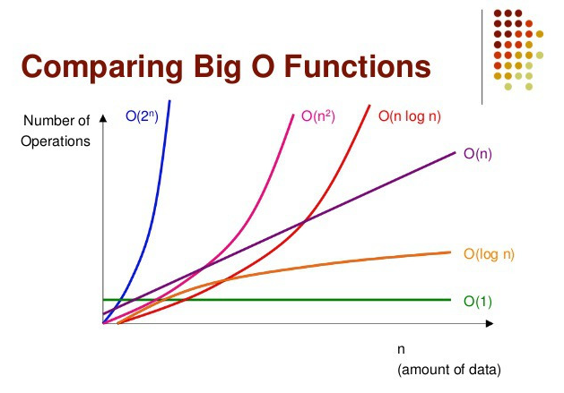

# 시간 복잡도

## 1 ) 시간 복잡도란?
**내 코드(또는 알고리즘)가 입력 데이터가 커질 때, 얼마나 오래 걸릴지**를 수학적으로 표현
- 알고리즘에서의 시간 복잡도는 주어진 문제를 해결하기 위한 연산 횟수를 의미함
  - 일반적으로 수행시간은 1억번의 연산을 1초의 시간으로 간주하여 예측함
    - ex) 시간 제한 2초 -> 2억번의 연산안에 답을 구해야 함 

## 2 ) 시간 복잡도 유형
- 빅-오메가 : 최선 일 때 (base case)의 연산 횟수를 나타냄 
- 빅-세타 : 보통 일 때 (average case)의 연산 횟수를 나타냄 
- [✅] 빅-오 : 최악 일 때 (worst case)의 연산 횟수를 나타냄
  - 알고리즘 문제 풀이에는 최악의 경우를 생각해야하기에 해당 복잡도를 사용해야 함  

## 3 ) 연산 횟수 계산 방법
`연산 횟수 = 알고리즘 시간 복잡도 * 데이터의 최대 크기`
- ex) 정렬 문제의 경우 - [ 제한시간 2초 || 데이터 최대 크기 1,000,000 ]
  - 버블 정렬 : (1,000,000)²           = 1,000,000,000,000 > 2,000,000,000 ( 2초 * 1억 ) :: 👎 부적합 알고리즘 
  - 벙합 정렬 : 1,000,000log(1,000,000)  = 약 2,000,000       < 2,000,000,000 ( 2초 * 1억 ) :: 👍 적합 알고리즘 

## 4 ) 빅오 표기법 (big-O notation)
- 보통 알고리즘의 시간  복잡도와 공간 복잡도를 나타내는데 주로 사용
- 알고리즘의 효율성은 데이터 개수(n)가 주어졌을 때 덧셈, 뺄셈, 곱셈 같은 기본 연산의 횟수를 의미
- 알고리즘 효율성은 값이 클수록 즉, **그래프가 위로 향할수록 비효율적임을 의미**한다

### 4 - 1 ) 빅오 표기법 특징
- 상수항 무시 : `O(2N) -> O(N)`와 같이 상수항 무시하고 표기
  - 알고리즘의 효율성 또한 데이터 입력값(n)의 크기에 따라 영향 받기 때문에 상수항 같은 사소한 부분은 무시
- 영향력 없는 항 무시 : `O(N² + 2N +1) -> O(N²)`와 같이 영향력이 지배적인 N²를 제외하곤 무시
  - 빅오 표기법은 데이터의 입력값(n)의 크기에 따라 영향을 받기 때문에 가장 영향력이 큰것을 제외하곤 무시

### 4 - 2 ) 빅오 표기법 성능 비교

- 성능 순서 : `O(1) < O(log N) < O(N) < O(N log N) < O(N²) < O(2ⁿ)`
  - 왼쪽 효율 👍, 오른쪽 효율 👎

### 4 - 3 ) 빅오표기법 예시
- `O(1)` : 스택에서의 push, pop
  - 한번만에 데이터를 찾음
- `O(log N)` : 이진트리
  - 2의 제곱만큼 확인 하여 찾음
- `O(N)` : for문
  - 입력 받은 수 만큼 확인 하여 찾음
- `O(n log n)` : 퀵 정렬(quick sort), 병합정렬(merge sort), 힙 정렬(heap Sort)
- `O(N²)` : 이중 for문
- `O(2ⁿ)` : 파보나치 수열

## 5 ) O(1)
- 입력 데이터 크기와 상관없이 **‘항상’ 같은 시간에 실행**
  - 즉, 데이터가 1개든, 1000개든, 1억 개든 **딱 한 번만 동작**
  - 입력값이 증가하더라도 구하는 **시간은 증가하지 않을 때 O(1)** 표기
### 5 - 1 ) 예시 코드
```java
public class Main {
    public static void main(String[] args) {
        int[] numbers = {5, 10, 20, 40, 80}; // 데이터가 여러 개 있어도
        // O(1) 예시: 첫 번째 요소 출력
        System.out.println(numbers[0]);
    }
}
```

## 6 ) O(log N)
- 대표적인 예시 : **이진 탐색(Binary Search)**
  - 입력 데이터가 커져도, **매번 “절반”으로 잘라서 값을 구함** 그렇기에 `O(N)`보다 효율적임
  - `BST(Binary Search Tree)`의 경우가 여기에 해당
### 6 - 1 ) 예시 코드
```java
public class Main {
    
  public static void main(String[] args) {
    // 전제 조건 - 오름 차순으로 정렬 되어있어야 함
    int[] numbers = {2, 4, 6, 8, 10, 12, 14, 16, 18, 20};
    // 14를 찾는것이 목적
    int target = 14;
    
    // 가장 왼쪽 index
    int left = 0; 
    // 가장 오른쪽 index
    int right = numbers.length - 1;

    while (left <= right) {
        // 중간 index를 찾음
      int mid = (left + right) / 2;
      
      if (numbers[mid] == target) {     // 중간 index의 값과 비교 
        System.out.println("찾았다! 인덱스: " + mid);
        break;
      } else if (numbers[mid] < target) {
        left = mid + 1; // 오른쪽만 탐색
      } else {
        right = mid - 1; // 왼쪽만 탐색
      } // if - else
    } // while
    
  }
  
}
```

## 7 ) O(N)
- 대표적인 예시: 배열 전체 순회(for문)
  - **입력 크기만큼 한 번씩 다 확인하는 알고리즘**
  - 입력 데이터 수에 **비례해서 시간 소요**
### 7 - 1 ) 예시 코드
```java
public class Main {
  public static void main(String[] args) {
    int[] numbers = {3, 7, 2, 9, 5};
    // 가장 첫번째 index의 값을 최대값으로 지정
    int max = numbers[0];

    for (int i = 1; i < numbers.length; i++) { // 1 index 부터 시장
      // 다음번 index의 값이 클 경우 max 값 교체 
      if (numbers[i] > max)  max = numbers[i];
    } // loop

    System.out.println("최댓값: " + max);
  }
}
```

## 8 ) O(N log N)
- N개의 전체 데이터를 다루면서, **log N 단계로 나누거나 합치는 작업을 수행**하는 알고리즘
  - 대표적인 정렬 방식 : 병합 정렬(Merge Sort), 힙 정렬(Heap Sort)
  - 공식 : `O(N x log N)`  - log N 은 해당 값이 2의 몇 재곱인지 확인하는 것 ` log 1024  = 10`
    - ex) `1024 log 1024 = 10240`
- ☠️ 햇갈렸던 점 : 왜? 정렬에는 시간 복잡도가 더 효율적인 `O(N)`을 사용하지 않는가?
  - ✅ 해결 : 정렬에서는 단순히 한 번 “보기만” 하는 게 아니라, **서로 비교하고 자리를 바꾸는 작업이 필요**하기 때문
### 8 - 1 ) 예시 코드
- 병합 정렬(Merge Sort) 사용
  - 리스트 전체를 **작게 쪼개서 각각 정렬한 다음, 다시 차례대로 합쳐서 정렬**하는 방법
```java
public class MergeSortExample {

    public static void main(String[] args) {
        int[] arr = {5, 3, 8, 4, 2, 7, 1, 6};
        
        // 배열 정렬 시작
        mergeSort(arr, 0, arr.length - 1);

        // 정렬된 배열 출력
        System.out.println(Arrays.toString(arr)); // 정렬 결과 출력
    }

    /**
     * 배열을 병합 정렬하는 메서드
     *
     * @param arr 정렬할 배열
     * @param left 현재 정렬할 범위의 왼쪽 인덱스
     * @param right 현재 정렬할 범위의 오른쪽 인덱스
     */
    public static void mergeSort(int[] arr, int left, int right) {
        if (left < right) { // 원소가 1개 이상이면
            int mid = (left + right) / 2;

            // 재귀 함수 - 왼쪽 반 정렬
            mergeSort(arr, left, mid);
            
            // 재귀 함수 - 오른쪽 반 정렬
            mergeSort(arr, mid + 1, right); 

            // 병합
            merge(arr, left, mid, right);   
        } // if
    }

    /**
     * 정렬된 두 배열 부분을 합치는 메서드
     *
     * @param arr 원본 배열
     * @param left 합칠 범위의 왼쪽 인덱스
     * @param mid 왼쪽과 오른쪽을 나누는 중간 인덱스
     * @param right 합칠 범위의 오른쪽 인덱스
     */
    public static void merge(int[] arr, int left, int mid, int right) {
        // 크기에 맞는 임시 배열 생성 (크기는 현재 범위 크기만큼)
        int[] temp = new int[right - left + 1];

        int i = left;      // 왼쪽 시작 인덱스
        int j = mid + 1;   // 오른쪽 시작 인덱스
        int k = 0;         // temp 배열 인덱스

        // 왼쪽과 오른쪽 배열을 비교해서 작은 값을 temp에 복사
        while (i <= mid && j <= right) {
            if (arr[i] <= arr[j]) {
                temp[k++] = arr[i++];
            } else {
                temp[k++] = arr[j++];
            } // if - else
        } // loop

        // 왼쪽에 남은 데이터 복사
        while (i <= mid) {
            temp[k++] = arr[i++];
        } // loop

        // 오른쪽에 남은 데이터 복사
        while (j <= right) {
            temp[k++] = arr[j++];
        } // loop

        // temp 배열의 내용을 원본 배열(arr)에 복사
        for (int idx = 0; idx < temp.length; idx++) {
            arr[left + idx] = temp[idx];
        } // loop
    }
}
```

## 9 ) O(N²)
- 대표적인 예시: 이중 반복문(중첩 for문)
  - 입력 데이터의 크기(N)가 커질 때, 실행 시간이 대략 **N의 제곱에 비례**
  - 입력이 2배가 되면 → 수행 시간은 4배
  - 입력이 3배가 되면 → 수행 시간은 9배
  - 입력이 4배가 되면 → 수행 시간은 14배
### 9 - 1 ) 예시 코드
```java
public class Main {
  public static void main(String[] args) {
    for (int i = 0; i < n; i++) { // 외부 for문 → N번 반복
      for (int j = 0; j < n; j++) { // 내부 for문 → N번 반복
        // 어떤 작업 (예: 비교, 출력, 계산 등)
      }
    }
  }
}
```

## 10 ) O(2ⁿ)
- 대표적인 예시: 재귀를 이용한 모든 경우의 수 탐색 (예: 피보나치 수열, 부분집합 구하기)
  - 입력 데이터가 **하나 늘어날 때마다 작업량이 2배 증가**
  - 극도로 빠르게 작업량이 폭발하는 무서운 복잡도
  - N이 작을 때만 사용 가능 (N이 조금만 커져도 시간 초과 위험)
  - 입력이 4배가 되면 → 수행 시간은 14배
- `O(2ⁿ)`는 n이 20을 넘으면 보통 사용할 수 없음 - 시간이 많으 소요
  -  **동적 계획법(DP)**을 이용해서 `O(N)` 또는 `O(N²)`로 최적화하여 사용 하는 경우가 많음
### 10 - 1 ) 예시 코드
```java
public class Main {
  public static int fib(int n) {
    if (n <= 1) return n; // 종료 조건

    // 각각 n-1, n-2를 다시 계산
    return fib(n - 1) + fib(n - 2);
    // fib(n - 1) = 3
        // fib(4) + fib(3) 2 + 1 = 3
            // fib(3) + fib(1) 1 + 1 = 2
                // fib(1) + fib(0) 1 + 0 = 1
                    // fib(1) = return 1
    // fib(n - 2) = 2
        // fib(2) + fib(1) 1 + 1;
            // fib(1) + fib(0) 1 + 0;
                // fib(1) = return 1;
  }

  public static void main(String[] args) {
    int n = 5;
    System.out.println(fib(n)); // 피보나치 수열의 n번째 수 출력
  }
}
```
